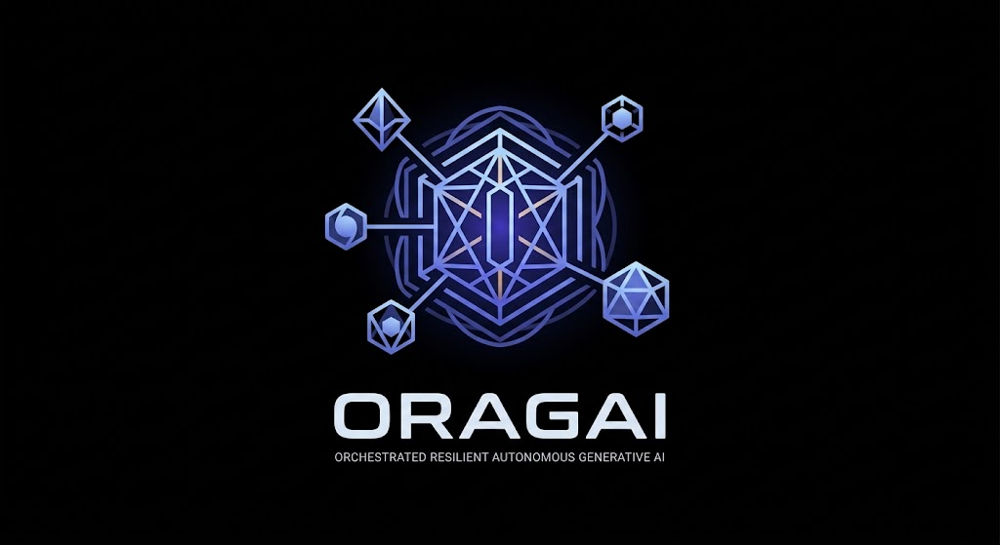
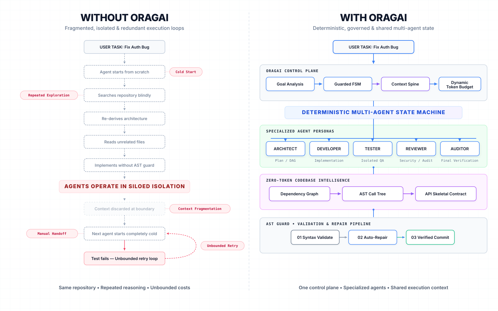

<div align="center">

<p align="center">
  
</p>

# ⚡ ORAGAI

### *Orchestrated Resilient Autonomous Generative AI*

**Production-Grade Multi-Agent Software Engineering Framework with Guarded FSM Lifecycle, Zero-Token Architecture Intelligence & Self-Healing SRE Mesh.**

<br />

<p align="center">
  
</p>

> **Hero Architecture Diagram:** The ORAGAI Deterministic Multi-Agent Control Plane orchestrating 5 specialized agent personas (*Architect*, *Developer*, *Tester*, *Reviewer*, *Auditor*) with centralized state machines, in-memory AST guards, and dynamic token governance.

<br />

[](https://www.python.org/)
[](LICENSE)
[](#️-architecture--hexagonal-design)
[](#-testing--verification)
[](docs/guides/DOCKER_GUIDE.md)
[](CONTRIBUTING.md)

[Features](#-key-innovations) •
[Quickstart](#-quickstart-in-60-seconds) •
[Architecture](#️-architecture--hexagonal-design) •
[Execution Modes](#-execution-modes) •
[Why ORAGAI?](#️-why-oragai-vs-alternatives) •
[Documentation](#-documentation-index)

</div>

---

## 💡 What is ORAGAI?

**ORAGAI** is an autonomous multi-agent software engineering framework engineered to bridge the gap between toy AI prototypes and deterministic, production-grade software development.

Unlike standard conversational agents that loop unpredictably and burn tokens, ORAGAI enforces **strict mathematical governance**, **hexagonal boundaries**, **zero-token static analysis**, and an **in-memory AST Guard** that intercepts and auto-heals code defects before they ever touch your disk.

```
                                  USER TASK / SPECIFICATION
                                             │
                                             ▼
 ┌───────────────────────────────────────────────────────────────────────────────────────┐
 │                           ORAGAI DETERMINISTIC CONTROL PLANE                          │
 │     Guarded FSM Engine  │  Dynamic Token Governor  │  Context Handoff Synthesizer     │
 └───────┬──────────────┬──────────────┬──────────────┬──────────────┬───────────────────┘
         │              │              │              │              │
         ▼              ▼              ▼              ▼              ▼
   ┌───────────┐  ┌───────────┐  ┌───────────┐  ┌───────────┐  ┌───────────┐
   │ ARCHITECT │  │ DEVELOPER │  │  TESTER   │  │ REVIEWER  │  │  AUDITOR  │
   │   Agent   │  │   Agent   │  │   Agent   │  │   Agent   │  │   Agent   │
   └─────┬─────┘  └─────┬─────┘  └─────┬─────┘  └─────┬─────┘  └─────┬─────┘
         │              │              │              │              │
         ▼              ▼              ▼              ▼              ▼
   ┌───────────┐  ┌───────────┐  ┌───────────┐  ┌───────────┐  ┌───────────┐
   │  PLAN.md  │  │ Clean TDD │  │ Pytest QA │  │ Security  │  │ Forensic  │
   │  DAG Spec │  │ Codebase  │  │ Isolation │  │ Audit Gate│  │ Health DB │
   └───────────┘  └───────────┘  └───────────┘  └───────────┘  └───────────┘
                                       │
                                       ▼
 ┌───────────────────────────────────────────────────────────────────────────────────────┐
 │                             COGNITIVE SENTINEL & SRE MESH                             │
 │   ASTGuard Auto-Heal  │  Terminal Translator  │  Cloud Fallback  │  SQLite WAL SRE    │
 └───────────────────────────────────────────────────────────────────────────────────────┘
```

---

## ✨ Key Innovations

| Feature | Description |
|---|---|
| 🧩 **13-Engine Modular Platform** | Composable Langflow-style architecture featuring discrete Core, Graph, Agent, Model, Tool, Skill, Memory, Task, Execution, Governance, Verification, Event, and Plugin engines. |
| 🛡️ **Guarded FSM & Graph Engine** | Deterministic state execution supporting DAG and cyclic workflows, formal guard predicates, and visual canvas compatibility. |
| 🔍 **Zero-Token Codebase Intelligence** | Ingests full-repo dependency graphs, call trees, and API skeletons via Graft integration without consuming a single LLM token. |
| 🩹 **Self-Healing AST Guard** | Intercepts all file writes in-memory, auto-repairs missing imports, unclosed colons, and syntax defects before disk commit. |
| 💰 **Dynamic Token & Adaptive Governor** | Multi-dimensional governance combining deterministic token ceilings, stagnation velocity detection, chaos mitigation, and circuit breakers. |
| 🔄 **Multi-Tier Cloud Resilience** | Seamless real-time failover across OpenRouter, Google Gemini, OpenAI, Anthropic, and Groq with zero session disruption. |
| 🏗️ **Universal Component Contracts** | Standardized `IComponent` interface with typed input/output ports for visual drag-and-drop workflow assembly. |
| 📊 **Autonomous Verification Engine** | Independent evidence-based completion gates measuring test execution, security scans, and code diff integrity. |

---

## ⚡ Quickstart in 60 Seconds

### Installation

```bash
# Clone the repository
git clone https://github.com/crrrowz/orchestrator-ai-agent.git
cd orchestrator-ai-agent

# Install dependencies with uv (recommended)
uv sync

# Or with pip
uv pip install -e .
```

### Configure Secrets

```bash
cp .env.example .env
# Edit .env and insert your preferred provider API key (OpenRouter, Gemini, OpenAI, etc.)
```

### Python CLI Direct (Native Python Environment)

```bash
# Verify environment and model connectivity (0 tokens)
uv run python -m orchestrator.main --check-config

# Execute a TDD development task
uv run python -m orchestrator.main "Build a Sliding Window RateLimiter class with unit tests" --mode dev-test

# Run full 4-agent architectural pipeline
uv run python -m orchestrator.main "Design and implement an OAuth2 token validation service" --mode full

# Run deep codebase security & architecture audit
uv run python -m orchestrator.main --mode audit

# Run automated audit and fix remediation loop
uv run python -m orchestrator.main --mode audit-fix
```

### Python Programmatic API

```python
from orchestrator import Orchestrator, OrchestratorConfig

config = OrchestratorConfig(
    workspace_path="./workspace",
    max_budget_usd=1.50,
    max_iterations=6,
)

orchestrator = Orchestrator(config)
result = orchestrator.run_task(
    task="Implement an LRU Cache with TTL expiration and comprehensive pytest suite",
    mode="dev-test"
)

print(f"Status: {result['status']}")  # SUCCESS | FAILED | BUDGET_EXHAUSTED
```

---

## 🐳 Docker Deployment

ORAGAI provides production-ready Docker containers with volume isolation:

```bash
# Build development image
docker build --target development -t oragai:dev .

# Run test suite inside isolated Linux container
docker run --rm --entrypoint pytest oragai:dev tests/ -v

# Run an orchestration task inside Docker (ENTRYPOINT is already python -m orchestrator.main)
docker run --rm -it --env-file .env oragai:dev "Build rate limiter" --mode dev-test
```

> 📖 For full Docker Compose and remote VM SSH workflows, see the **[Docker Architecture & Operations Guide](docs/guides/DOCKER_GUIDE.md)**.

---

## 🎯 Execution Modes

ORAGAI provides 5 specialized orchestration modes:

| Mode | Flag | Description | Active Personas |
|---|---|---|---|
| **Dev-Test Loop** | `--mode dev-test` *(Default)* | Rapid iterative TDD loop: Code ➔ Preflight ➔ Test ➔ Fix. Bypasses Tester LLM on fix iterations to save 65% tokens. | Developer, Tester |
| **Full Pipeline** | `--mode full` | Full enterprise lifecycle: Formal Spec ➔ Milestone DAG ➔ Implementation ➔ QA ➔ Review Verdict ➔ Git Commit. | Architect, Developer, Tester, Reviewer |
| **Codebase Audit** | `--mode audit` | Zero-token static analysis + Deep Auditor inspection generating structured findings. | Auditor |
| **Audit & Auto-Fix** | `--mode audit-fix` | Continuous scan-remediate-verify self-healing loop directly on working tree without Git overhead. | Auditor, Developer |
| **Documentation** | `--mode docs` | Automated technical authoring keeping README, API reference, and architecture specs in sync. | Documentation |

---

## ⚖️ Why ORAGAI vs. Alternatives?

### Execution Paradigm Comparison

<p align="center">
  
</p>

> **Figure 3: Isolated Agent Calls vs. ORAGAI Governed Execution.** Comparing fragile, blind repository scans and runaway retry loops against ORAGAI's shared context spine, dynamic budget quotas, and pre-commit AST guards.

<br />

| Capability | ORAGAI | CrewAI | AutoGen | LangGraph |
|---|:---:|:---:|:---:|:---:|
| **Deterministic Guarded FSM** | ✅ **11-State Guarded** | ❌ Heuristic | ❌ Freeform Conversational | ⚠️ Manual Graph |
| **Zero-Token Graph Ingestion** | ✅ **Graft Integration** | ❌ Context Dump | ❌ Context Dump | ❌ Context Dump |
| **In-Memory AST Auto-Healing** | ✅ **ASTGuard** | ❌ | ❌ | ❌ |
| **Token Phase Partitioning** | ✅ **Dynamic 4-Phase** | ❌ | ❌ | ❌ |
| **Multi-Provider Cloud Mesh** | ✅ **Auto-Failover** | ⚠️ Custom | ⚠️ Custom | ⚠️ Custom |
| **Role-Based Workspace RBAC** | ✅ **Strict Write Scopes** | ❌ Shared FS | ❌ Shared FS | ❌ Shared FS |
| **Cross-Platform UNIX Translation** | ✅ **Windows/Linux Native** | ❌ | ❌ | ❌ |

---

### Architectural Divergence in Practice

<p align="center">
  
</p>

> **Figure 4: Detailed Structural Comparison.** Left: fragmented workflow with cold starts, blind repository parsing, and context loss. Right: ORAGAI unified control plane with zero-token intelligence, specialized personas, and clean AST validation.

<br />

---

## 🏛️ Architecture & Hexagonal Design

The codebase strictly adheres to **Hexagonal (Ports & Adapters) Architecture** governed by an 8-stage deterministic state pipeline:

<p align="center">
  
</p>

> **Figure 1: ORAGAI 8-Stage Lifecycle Architecture.** Visualizes the flow from Task Ingestion (01) through Zero-Token Analysis (02), Formal Planning (03), Governance (04), Role-Specialized Dispatch (05), In-Memory Validation (06), SRE Mesh Recovery (07), to Verifiable Cryptographic Completion (08).

<br />

### Comprehensive Multi-Agent Constellation Mesh

<p align="center">
  
</p>

> **Figure 2: Multi-Agent Orbital Constellation.** 6-tier hierarchical view detailing active orchestration paths between Governance (L1), Zero-Token Intelligence (L2), Specialized Agents (L3), Execution Spine (L4), AST Protection (L5), and the Cloud Resilience Provider Mesh (L6).

<br />

```text
.
├── orchestrator/
│   ├── core/                # Core domain abstractions, invariants, and protocols
│   ├── domain/              # Pure Pydantic models (TaskTruth, Evidence, Audit, Recovery)
│   ├── ports/               # Driving (CLI, FSM) & Driven (VCS, Tools, Storage, Runtime) ports
│   ├── governance/          # Guarded FSM, Completion Gates, Resource Governor, Stagnation Detector
│   ├── workstreams/         # Micro-TDD Loop, Milestone DAG, Context Synthesis, Review Parsing
│   ├── pipeline/            # Execution engines (DevTest, Full, Audit, AuditFix, Docs, Strangler Guard)
│   ├── sentinel/            # SRE Mesh: ASTGuard, Self-Healing, Cloud Governor, Diagnostics DB
│   ├── adapters/            # Language & Runtime Adapters (Python, Node, VCS, Polyglot Driver Mesh)
│   ├── tools/               # Hardened Sandbox, Parameterized Terminal & RBAC File Tools
│   ├── llm/                 # Unified Multi-Provider LLM Factory, Pricing & Resilience Mesh
│   ├── context/             # Dynamic Prompt Builders, Graft Injectors, Context Handoff Mesh
│   ├── diagnostics/         # Telemetry aggregation, Full-text Search, SQLite WAL Store
│   └── cli/                 # Interactive CLI, Wizard, Diagnostics Dashboard
├── tests/                   # 50 test modules (538 automated tests)
├── docs/                    # Deep-dive architecture and operational guides
├── Dockerfile               # Multi-stage container specification
├── docker-compose.yml       # Composable dev, cli, and test services
└── pyproject.toml           # Package definition (Python >=3.12)
```

---

## 🧪 Testing & Verification

ORAGAI enforces strict **continuous self-verification**:

```bash
# Run the entire test suite
uv run pytest tests/ -v

# Run with concise progress
uv run pytest tests/ -q
```

- **50 Test Modules** covering all architectural layers.
- **~458 Test Functions** running deterministically on both Windows and Linux.
- **100% Zero Regression Guarantee** enforced on every milestone.

---

## 📚 Documentation Index

The complete documentation suite is organized in the **[`docs/`](docs/INDEX.md)** directory:

- 📖 **[Documentation Hub & Index](docs/INDEX.md)** — Central navigation table of contents.
- 🚀 **Guides (`docs/guides/`)**:
  - 🐳 **[Docker Architecture & Operations Guide](docs/guides/DOCKER_GUIDE.md)** — Dual-architecture container deployment manual.
  - ⚙️ **[Configuration Reference Manual](docs/guides/CONFIG_REFERENCE.md)** — Complete 47-parameter configuration matrix.
- 🏛️ **Architecture (`docs/architecture/`)**:
  - 📖 **[API & Architecture Contract](docs/architecture/API_REFERENCE.md)** — Full programmatic Python API reference.
  - 🔍 **[360° Architectural Assessment](docs/architecture/ARCHITECTURAL_ASSESSMENT.md)** — Deep-dive system boundaries & invariants.
  - ⚡ **[Native Code Intelligence](docs/architecture/CODE_INTELLIGENCE_REVIEW.md)** — Zero-token Graft AST indexing & review system.
  - 🔬 **[Orchestration Failure Analysis](docs/architecture/FAILURE_ANALYSIS.md)** — Forensic performance & bottleneck investigation.
- 📐 **Implementation Plans (`docs/plans/`)**:
  - 🗺️ **[P0 through P14 Engineering Blueprints](docs/plans/)** — 15 comprehensive architectural specifications.
- 📊 **Progress & Reports (`docs/execution/` & `docs/reports/`)**:
  - 📈 **[Milestone Progress Log](docs/execution/progress.md)** — Verifiable BITE milestones & PER metrics.
  - 📋 **[Documentation Drift Report](docs/reports/DOCUMENTATION_DRIFT_REPORT.md)** — Forensic documentation synchronization audit.

---

## 🤝 Contributing

We welcome contributions from the community! Please read **[CONTRIBUTING.md](CONTRIBUTING.md)** and our **[Code of Conduct](CODE_OF_CONDUCT.md)** before submitting pull requests.

---

## 🛡️ Security

For vulnerability reporting guidelines, please see **[SECURITY.md](SECURITY.md)**.

---

## 📄 License

This project is licensed under the **MIT License** — see the [LICENSE](LICENSE) file for details.
