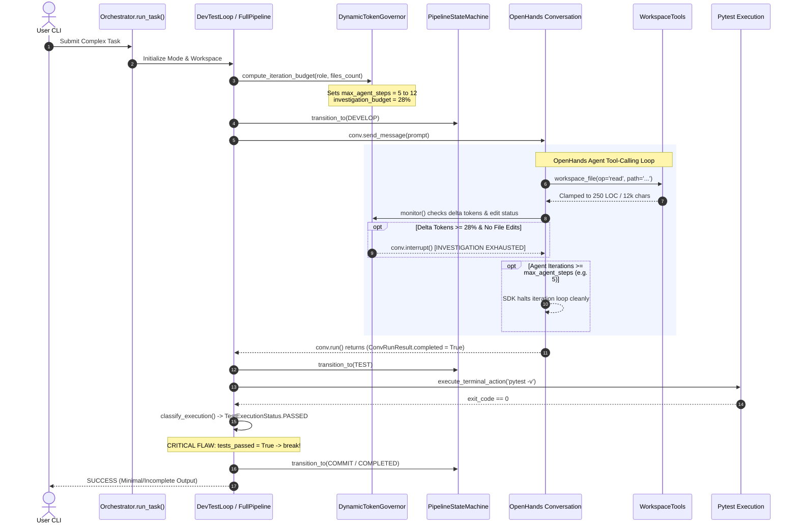

Viewed state_machine.py:1-120
Viewed pytest_parser.py:1-100
Viewed pytest_parser.py:180-308
Viewed pytest_parser.py:101-180
Viewed reviewer_parser.py:1-90
Viewed full_pipeline.py:650-760
Viewed full_pipeline.py:761-793
Viewed audit_fix_pipeline.py:1-120
Listed directory tools
Viewed workspace_tools.py:1-100
Viewed workspace_tools.py:150-220
Viewed workspace_tools.py:221-300
Viewed workspace_tools.py:301-330
Viewed workspace_tools.py:800-950
Viewed workspace_tools.py:775-808
Viewed milestone_dag.py:1-100
Viewed checkpoint.py:1-85
Viewed base_pipeline.py:100-150
Searched for "class ContextManager"
Viewed manager.py:1-100
Searched for "from openhands.sdk"
Viewed sdk_patch.py:1-100
Viewed pipeline_controller.py:1-50
Listed directory telemetry
Viewed schemas.py:1-53
Viewed base_pipeline.py:340-430
Viewed base_pipeline.py:30-60
Viewed base_pipeline.py:650-757
Listed directory sentinel
Viewed command_interceptor.py:1-100

# ORAGAI — 360° Forensic Performance & Orchestration Failure Analysis

> **Document Type:** Principal Forensic Architecture & Systems Engineering Audit  
> **Target System:** ORAGAI Multi-Agent Autonomous Software Engineering Orchestrator  
> **Source Repository:** `orchestrator-ai-agent`  
> **Audit Status:** Complete Forensic Investigation (No Production Code Modified)

---

# 1. Executive Summary

This forensic investigation analyzes why the ORAGAI multi-agent orchestrator consistently produces shallow code implementations, executes superficial audits, and terminates complex engineering requests prematurely.

### Core Forensic Finding:
The primary cause of shallow, incomplete execution is **not model intelligence limitations or prompt phrasing**. The root cause is a fundamental architectural pathology:

> **The orchestration engine conflates *Resource Safety Governance* with *Work Lifecycle Completion*, enforcing hard micro-step cutoffs and equating binary validation signals (`exit_code == 0`) with domain goal completeness.**

The system operates as a **Defensive Execution Cage**:
1. It assigns agents micro-step budgets (as few as 5 to 12 turns) regardless of task complexity ([token_governance.py:L108-116](file:///d:/files/Contracted%20projects/IdeaProjects/orchestrator-ai-agent/orchestrator/control/token_governance.py#L108-L116)).
2. It interrupts agents mid-investigation if they inspect files without immediate edits ([base_pipeline.py:L304-324](file:///d:/files/Contracted%20projects/IdeaProjects/orchestrator-ai-agent/orchestrator/pipeline/base_pipeline.py#L304-L324)).
3. It clamps file reads to 250 lines / 12,000 characters per call ([workspace_tools.py:L31-32](file:///d:/files/Contracted%20projects/IdeaProjects/orchestrator-ai-agent/orchestrator/tools/workspace_tools.py#L31-L32)).
4. It dictates arbitrary prompt limits that force audits to finish at step 4-5 after viewing only 2-3 files ([audit_pipeline.py:L158-174](file:///d:/files/Contracted%20projects/IdeaProjects/orchestrator-ai-agent/orchestrator/pipeline/audit_pipeline.py#L158-L174)).
5. When OpenHands SDK hits the step ceiling, `ConvRunResult.completed` silently defaults to `True` ([base_pipeline.py:L56](file:///d:/files/Contracted%20projects/IdeaProjects/orchestrator-ai-agent/orchestrator/pipeline/base_pipeline.py#L56)), registering step exhaustion as successful completion.
6. In the development loop, a single pytest run returning exit code `0` immediately breaks the loop ([dev_test_loop.py:L277-280](file:///d:/files/Contracted%20projects/IdeaProjects/orchestrator-ai-agent/orchestrator/pipeline/dev_test_loop.py#L277-L280)), even if zero functional requirements were tested or implemented.

---

# 2. System Under Investigation

| Subsystem | Primary Code Location | Declared Architectural Responsibility | Actual Observed Runtime Behavior |
| :--- | :--- | :--- | :--- |
| **Pipeline Controller** | [orchestrator/control/pipeline_controller.py](file:///d:/files/Contracted%20projects/IdeaProjects/orchestrator-ai-agent/orchestrator/control/pipeline_controller.py) | Non-blocking thread-safe stop/pause/abort signaling | Operates reliably for manual signals; relies on external triggers. |
| **Token Governor** | [orchestrator/control/token_governance.py](file:///d:/files/Contracted%20projects/IdeaProjects/orchestrator-ai-agent/orchestrator/control/token_governance.py) | Dynamic task-aware token budgeting & phase allocation | **Throttles work depth**: limits single-file tasks to 5 agent turns and kills investigation at 28% budget. |
| **State Machine (FSM)** | [orchestrator/pipeline/state_machine.py](file:///d:/files/Contracted%20projects/IdeaProjects/orchestrator-ai-agent/orchestrator/pipeline/state_machine.py) | Non-linear lifecycle stage transition enforcement | Pure enum lookup table (`ALLOWED_TRANSITIONS`); **zero guard predicates**, zero evidence checks. |
| **Base Pipeline** | [orchestrator/pipeline/base_pipeline.py](file:///d:/files/Contracted%20projects/IdeaProjects/orchestrator-ai-agent/orchestrator/pipeline/base_pipeline.py) | OpenHands conversation wrapper, telemetry, budget monitor | Kills exploration loops via `conv.interrupt()`; defaults truncated runs to `completed=True`. |
| **Dev-Test Loop** | [orchestrator/pipeline/dev_test_loop.py](file:///d:/files/Contracted%20projects/IdeaProjects/orchestrator-ai-agent/orchestrator/pipeline/dev_test_loop.py) | Autonomous test-driven implementation loop | **Early exit trap**: breaks out on first `exit_code == 0` with zero requirement verification. |
| **Full Pipeline** | [orchestrator/pipeline/full_pipeline.py](file:///d:/files/Contracted%20projects/IdeaProjects/orchestrator-ai-agent/orchestrator/pipeline/full_pipeline.py) | 4-agent waterfall (Architect ➔ Developer ➔ Tester ➔ Reviewer) | Serial handoff with context loss; Developer turns constrained per milestone; review fix loop bounded. |
| **Audit Pipeline** | [orchestrator/pipeline/audit_pipeline.py](file:///d:/files/Contracted%20projects/IdeaProjects/orchestrator-ai-agent/orchestrator/pipeline/audit_pipeline.py) | Deep static + LLM repository audit | **Hardcoded shallow audit prompt**: mandates step 4-5 exit and limits inspection to 2-3 files. |
| **Workspace Tools** | [orchestrator/tools/workspace_tools.py](file:///d:/files/Contracted%20projects/IdeaProjects/orchestrator-ai-agent/orchestrator/tools/workspace_tools.py) | Sandboxed file I/O and terminal execution | Clamps reads to 250 lines / 12k chars; blocks all shell pipes (`|`) even after Sentinel translates them. |
| **Pytest Parser** | [orchestrator/analysis/pytest_parser.py](file:///d:/files/Contracted%20projects/IdeaProjects/orchestrator-ai-agent/orchestrator/analysis/pytest_parser.py) | Failure classification & compact failure reporting | Equates `exit_code == 0` to complete feature correctness without checking test count or coverage. |

---

# 3. Observed Failure Symptoms

```
                                  [ USER REQUEST ]
                       "Build comprehensive rate limiter"
                                         │
                 ┌───────────────────────┴───────────────────────┐
                 ▼                                               ▼
         [ AUDIT PIPELINE ]                              [ DEV-TEST PIPELINE ]
  Hardcoded prompt: "Inspect 2-3 files"           TokenGovernor sets: max_agent_steps=5
  Step 4-5 forced exit mandate                    Clamped reads: 250 LOC / 12,000 chars
                 │                                               │
                 ▼                                               ▼
     Reads 2 files, writes report                   Writes 1 stub class + 1 trivial test
   "Architecture Health: 98/100"                    Runs pytest -> exit_code == 0 (PASS)
                 │                                               │
                 ▼                                               ▼
        [ SHALLOW REPORT ]                              [ PREMATURE EXIT ]
     0 actionable findings logged                    Loop breaks immediately at Pass 1
```

1. **The 98/100 Flattery Trap in Audits:** On a 149-file codebase, the Auditor produces a 38-line report declaring the system "Production Grade 98/100" with `findings: []` ([docs/audit_findings.json](file:///d:/files/Contracted%20projects/IdeaProjects/orchestrator-ai-agent/docs/audit_findings.json)). This causes downstream `audit-fix` to do zero work.
2. **Micro-Stub Development:** When asked to build a service, the Developer agent writes an initial stub with basic methods and one test. Because `pytest` passes, the loop terminates immediately without implementing edge cases or requirements.
3. **Investigation Token Kill:** Agents attempting to explore directory structures or read module dependencies trigger `is_investigation_exhausted()`, halting the agent before any code is generated.
4. **False Success on Exhaustion:** When `max_agent_steps` is exhausted, OpenHands halts cleanly. ORAGAI logs the step as `success=True` and moves to the next phase as if work completed.

---

# 4. End-to-End Execution Lifecycle Map



### Lifecycle Stage Failure Points:

| Stage | Controlling Code | Failure / Limitation Mechanism | Information Lost / Leakage |
| :--- | :--- | :--- | :--- |
| **Entry Point** | `orchestrator/main.py:L26-80` | Passes raw string; file paths passed as tasks resolved crudely. | Architectural intent and acceptance criteria not decomposed. |
| **Pipeline Selection** | `orchestrator.py:L44-58` | Selects mode without validating if workspace has test harness. | No preflight check on whether pytest can actually verify features. |
| **Budgeting** | `token_governance.py:L108-116` | Dynamic governor assigns 5 steps if `affected_files <= 1`. | Strips agent of ability to create multi-file architectures. |
| **Prompt Assembly** | `context/manager.py:L64-98` | Hard token limit (6000 tokens / 24,000 chars); truncates specs. | Original task requirements truncated if context is large. |
| **Agent Execution** | `base_pipeline.py:L224-226` | `conv.max_iteration_per_run = step_limit` (5 to 12). | Execution halts with no error; default `completed=True`. |
| **Tool Execution** | `workspace_tools.py:L301-325` | Clamps reads to 250 lines; clamps bytes to 12k chars. | Lower half of critical files completely invisible to agent. |
| **Terminal Tool** | `workspace_tools.py:L835-840` | Blocks pipe operator `|` across all shell calls. | Standard investigative CLI pipelines crash with exit code 126. |
| **Test Verification** | `dev_test_loop.py:L277-280` | `if test_result.status == PASSED: break`. | Zero check for test assertions, coverage, or requirement match. |
| **Handoff** | `full_pipeline.py:L629-636` | Passes only `git_diff[:4000]` to Reviewer. | Reviewer never sees original user prompts or full module context. |
| **Finalization** | `base_pipeline.py:L688-715` | Auto-commits git changes upon `exit_code == 0`. | Commits superficial stubs into repository history as "verified". |

---

# 5. The "Shallow Work" Problem: Detailed Evidence

### A. The 5-Step Trap in Development
In [token_governance.py:L108-116](file:///d:/files/Contracted%20projects/IdeaProjects/orchestrator-ai-agent/orchestrator/control/token_governance.py#L108-L116):
```python
if affected_files_count <= 1:
    base_budget = 40_000
    max_agent_steps = 5
elif affected_files_count == 2:
    base_budget = 80_000
    max_agent_steps = 7
else:
    base_budget = 120_000
    max_agent_steps = 8
```
**Runtime Consequence:** If a user asks to build a new feature in an empty workspace, `affected_files_count` is 0 or 1. The governor sets `max_agent_steps = 5`.
1. Turn 1: Agent calls `workspace_file` with `list` or `read` to orient itself.
2. Turn 2: Agent reads a related file.
3. Turn 3: Agent paginates or searches.
4. Turn 4: Agent writes a minimal draft file.
5. Turn 5: Step ceiling reached. Agent forced to conclude.
The agent cannot iterate, refine, or write complementary test suites.

### B. The 28% Investigation Trap
In [token_governance.py:L147-151](file:///d:/files/Contracted%20projects/IdeaProjects/orchestrator-ai-agent/orchestrator/control/token_governance.py#L147-L151) and [base_pipeline.py:L304-324](file:///d:/files/Contracted%20projects/IdeaProjects/orchestrator-ai-agent/orchestrator/pipeline/base_pipeline.py#L304-L324):
```python
investigation = int(total * 0.28)  # 28% of 40k = 11,200 tokens
...
if not governor.has_performed_edit and not role_name.lower().startswith("auditor"):
    governor.allocation.investigation_consumed = delta_tok
    if governor.is_investigation_exhausted():
        ConsoleOutput.warning(f"Agent {role_name} exhausted investigation token budget ({delta_tok:,} >= {governor.allocation.investigation_budget:,}) without code edits. Halting exploration loop.")
        conv.interrupt()
```
**Runtime Consequence:** Modern LLM prompts with injected system prompts, skills, and tools start at ~4,000–6,000 prompt tokens. A single tool observation reading a file can cost 2,500 tokens. After **two tool calls**, `delta_tok` exceeds 11,200 tokens. The background monitor immediately triggers `conv.interrupt()`. The agent is killed for "investigating too much" before it can write code.

---

# 6. Premature Termination Analysis

| Termination Condition | File | Line | Trigger | Intended Purpose | Actual Risk / Pathology |
| :--- | :--- | :---: | :--- | :--- | :--- |
| **Test Pass Break** | [dev_test_loop.py](file:///d:/files/Contracted%20projects/IdeaProjects/orchestrator-ai-agent/orchestrator/pipeline/dev_test_loop.py) | 277 | `test_result.status == PASSED` | Stop loop once tests pass | **Critical**: Breaks on trivial/stub tests; zero requirement verification. |
| **Full Pipeline Test Break** | [full_pipeline.py](file:///d:/files/Contracted%20projects/IdeaProjects/orchestrator-ai-agent/orchestrator/pipeline/full_pipeline.py) | 501 | `test_result.status == PASSED` | Stop test iterations | Same early exit; ignores whether tests exercised the actual specification. |
| **Investigation Exhausted** | [base_pipeline.py](file:///d:/files/Contracted%20projects/IdeaProjects/orchestrator-ai-agent/orchestrator/pipeline/base_pipeline.py) | 310 | `is_investigation_exhausted()` | Prevent runaway read-only loops | Kills legitimate deep exploration after only 1-2 tool calls. |
| **Hard Token Cap** | [base_pipeline.py](file:///d:/files/Contracted%20projects/IdeaProjects/orchestrator-ai-agent/orchestrator/pipeline/base_pipeline.py) | 325 | `delta_tok >= token_limit` | Prevent budget overrun | Halts turn mid-generation, corrupting JSON or leaving half-written files. |
| **Max Agent Steps** | [base_pipeline.py](file:///d:/files/Contracted%20projects/IdeaProjects/orchestrator-ai-agent/orchestrator/pipeline/base_pipeline.py) | 225 | `conv.max_iteration_per_run` | Prevent runaway conversation turns | Halts agent; pipeline treats completion as `True`, concealing truncation. |
| **Circuit Breaker** | [dev_test_loop.py](file:///d:/files/Contracted%20projects/IdeaProjects/orchestrator-ai-agent/orchestrator/pipeline/dev_test_loop.py) | 318 | `circuit_broken == True` | Prevent infinite loop on same error | Aborts on 2 identical errors even when agent is adjusting logic. |
| **Budget Ceiling** | [dev_test_loop.py](file:///d:/files/Contracted%20projects/IdeaProjects/orchestrator-ai-agent/orchestrator/pipeline/dev_test_loop.py) | 143 | `_get_total_cost() > max_budget_usd` | Prevent financial overrun | Default $0.50 halts paid models (Claude/GPT-4o) after 1-2 calls. |
| **Conversation Timeout** | [base_pipeline.py](file:///d:/files/Contracted%20projects/IdeaProjects/orchestrator-ai-agent/orchestrator/pipeline/base_pipeline.py) | 256 | `time - start >= timeout_seconds` | Prevent deadlock on hung process | Halts long-running test suites or large builds at 300s. |
| **Audit Prompt Mandate** | [audit_pipeline.py](file:///d:/files/Contracted%20projects/IdeaProjects/orchestrator-ai-agent/orchestrator/pipeline/audit_pipeline.py) | 173 | Step 4-5 write command | Force report generation | Forces auditor to write report prematurely and exit immediately. |

---

# 7. Completion Criteria Analysis

ORAGAI completely conflates **Execution Status** with **Functional Completeness**.

### The Conflation Hierarchy:
```
[ WHAT ORAGAI CHECKS ]                      [ WHAT SOFTWARE ENGINEERING REQUIRES ]
1. Tool did not crash                       1. User requirements satisfied
2. Agent stopped calling tools              2. Business logic edge cases implemented
3. pytest exit code == 0                    3. Test suite covers specification
4. Reviewer output matched JSON schema      4. Architecture conforms to domain invariants
        │                                                   │
        ▼                                                   ▼
"TASK COMPLETED SUCCESSFULLY"                      ACTUAL STATUS: INCOMPLETE
```

### Forensic Proof in Code:
1. In [dev_test_loop.py:L277-280](file:///d:/files/Contracted%20projects/IdeaProjects/orchestrator-ai-agent/orchestrator/pipeline/dev_test_loop.py#L277-L280):
   ```python
   if test_result.status == TestExecutionStatus.PASSED:
       tests_passed = True
       ConsoleOutput.success(f"All tests passed in iteration {iteration}!")
       break
   ```
   If the developer creates `test_dummy(): assert True`, pytest returns `exit_code == 0`. The system declares total victory.
2. In [base_pipeline.py:L56](file:///d:/files/Contracted%20projects/IdeaProjects/orchestrator-ai-agent/orchestrator/pipeline/base_pipeline.py#L56):
   ```python
   class ConvRunResult:
       completed: bool = True
   ```
   If the agent is forcefully stopped by OpenHands step limits, `completed` remains `True`. There is no check verifying whether the agent completed its declared goals.

---

# 8. Audit Pipeline Forensic Deep-Dive

### The "Shallow Audit" Prompt Anatomy
In [audit_pipeline.py:L158-174](file:///d:/files/Contracted%20projects/IdeaProjects/orchestrator-ai-agent/orchestrator/pipeline/audit_pipeline.py#L158-L174):
```python
"STRICT CONSTRAINTS & INSTRUCTIONS (MANDATORY 2-PHASE WORKFLOW):\n"
"PHASE 1 (Inspection - Max 3-4 steps):\n"
"1. Perform targeted inspection of 2-3 key hotspot files and architecture boundaries. Do NOT run repetitive or unbounded terminal exploration scripts.\n"
"PHASE 2 (Report Generation - MUST EXECUTE AT STEP 4-5):\n"
"2. Produce the exhaustive architectural audit in `docs/AUDIT_REPORT.md` (under `docs/`) and write verified structured findings to `docs/audit_findings.json`...\n"
"4. Once `docs/AUDIT_REPORT.md` and `docs/audit_findings.json` are written, conclude your turn immediately."
```

### Forensic Analysis of Audit Structural Defects:
1. **Instruction to Skim:** The LLM is explicitly commanded to inspect a maximum of 2-3 files in 3-4 steps.
2. **Mandated Early Exit:** The LLM is commanded to write the report at step 4-5 and "conclude your turn immediately".
3. **Absence of Deterministic Code Exploration Tools:** The Auditor has only `workspace_file` and `workspace_terminal`. It has no semantic call-graph explorer, no AST dependency cross-referencing tool, and no test coverage analyzer.
4. **Resulting Artifact:** The Auditor reads 2 files, reviews the clean Ruff lint, hallucinates that the system is perfect, writes a 98/100 score with 0 findings, and shuts down.

---

# 9. Development Pipeline Forensic Deep-Dive

### Developer ➔ Tester ➔ Developer Loop Evaluation:
In [dev_test_loop.py:L240-272](file:///d:/files/Contracted%20projects/IdeaProjects/orchestrator-ai-agent/orchestrator/pipeline/dev_test_loop.py#L240-L272):
* **Iteration 1:** Tester agent generates tests and runs pytest.
* **Iteration > 1 (Zero-Token Tester Skip):**
  ```python
  if iteration == 1:
      # Tester writes tests
  else:
      ConsoleOutput.info(f"Iteration {iteration}: Re-verifying fix directly via pytest (Zero-Token Tester Skip).")
  ```
  The Tester agent is **never invoked again after iteration 1**. If the Developer modifies code in iteration 2 in a way that invalidates test assumptions or introduces regressions not covered by the initial tests, the Tester agent is completely absent.
* **Reviewer Stage Context Truncation:**
  In [full_pipeline.py:L630](file:///d:/files/Contracted%20projects/IdeaProjects/orchestrator-ai-agent/orchestrator/pipeline/full_pipeline.py#L630):
  ```python
  git_diff = self.git.get_compact_diff(max_chars=4000) or self.git.get_status()
  ```
  The Reviewer is given at most 4,000 characters of diff (~1,000 tokens). On any non-trivial implementation, the Reviewer evaluates a truncated snippet.

---

# 10. Token Governance Analysis: Resource vs. Work

| Governance Domain | Target Metric | How It Should Be Handled | How ORAGAI Currently Handles It |
| :--- | :--- | :--- | :--- |
| **Resource Governance** | Dollar Cost, API Tokens, Context Saturation | Set rate limits, compress context, switch to cost-effective models, track token quotas. | Kills the execution thread via `conv.interrupt()` in [base_pipeline.py:L320](file:///d:/files/Contracted%20projects/IdeaProjects/orchestrator-ai-agent/orchestrator/pipeline/base_pipeline.py#L320). |
| **Work Governance** | Quality, Depth, Correctness, Requirement Coverage | Define acceptance criteria, AST validation, integration tests, evidence collection. | **Substitutes resource limits for work gates**: assumes 5 steps is "enough work" for 1 file. |

### The Token Governor Fallacy:
[token_governance.py](file:///d:/files/Contracted%20projects/IdeaProjects/orchestrator-ai-agent/orchestrator/control/token_governance.py) determines work depth based purely on `affected_files_count`. It has no semantic awareness of:
* Algorithmic complexity
* Number of declared user requirements
* Failure trace depth
* Architectural layers (DB, API, Service, Model)

It acts as an **algorithmic throttle on agent cognition**.

---

# 11. Progress Detection Analysis

ORAGAI has almost **zero semantic progress detection**.

### What ORAGAI Treats as Progress:
1. `curr_diff != prev_diff` (Git diff hash changed).
2. `compact_failure != prev_failure` (Pytest error string changed).

### What ORAGAI Cannot Detect:
* **Circular Regressions:** Agent fixes Error A in file 1, causing Error B in file 2. Then fixes Error B, re-introducing Error A.
* **Semantic No-Ops:** Agent adds comments or changes whitespace; Git diff changes, so circuit breaker treats it as "progress".
* **Test Evasion:** Developer deletes or weakens test assertions so pytest passes; ORAGAI treats this as 100% success.

---

# 12. Circuit Breaker Forensic Analysis

In [orchestrator/telemetry/recorder.py:L148-180](file:///d:/files/Contracted%20projects/IdeaProjects/orchestrator-ai-agent/orchestrator/telemetry/recorder.py#L148-L180):
```python
def check_circuit_breaker(self, diff_content: str, failure_signature: str) -> bool:
    diff_hash = hashlib.sha256(diff_content.encode("utf-8")).hexdigest()
    # If the same failure signature occurs consecutively with identical diff hash
    if failure_signature == self._last_failure_sig and diff_hash == self._last_diff_hash:
        self._consecutive_stagnant_iterations += 1
    else:
        self._consecutive_stagnant_iterations = 0
...
    if self._consecutive_stagnant_iterations >= threshold:
        return True
```
### Vulnerability Analysis:
1. **Low Default Threshold:** `threshold = 2` ([core/config.py:L75](file:///d:/files/Contracted%20projects/IdeaProjects/orchestrator-ai-agent/orchestrator/core/config.py#L75)).
2. **False Positives:** If an agent encounters a complex compile error, spends turn 1 thinking or running read-only inspection commands (diff unchanged), and runs tests again, `_consecutive_stagnant_iterations` hits 2. The circuit breaker trips and **aborts the entire pipeline**.
3. **No Adaptive Strategy:** The breaker only knows one action: `ABORT`. It cannot prompt the agent with: "You have not changed code across two iterations. Switch strategy."

---

# 13. OpenHands SDK Boundary Analysis

| Responsibility | ORAGAI Owned | OpenHands SDK Owned | Overlap / Conflict | Architectural Pathology |
| :--- | :---: | :---: | :---: | :--- |
| **Agent Execution Loop** | | **✓** | **Severe Overlap** | ORAGAI runs a background monitor thread while OpenHands runs its internal loop, competing to interrupt `conv`. |
| **Step Limits** | **✓** | **✓** | **Severe Overlap** | OpenHands has `max_iteration_per_run`; ORAGAI artificially caps it to 5-12, undercutting SDK capabilities. |
| **Tool Execution** | **✓** | **✓** | **Conflict** | OpenHands tool schema is wrapped by ORAGAI custom Pydantic schemas, with monkey-patches in `sdk_patch.py`. |
| **Workspace Sandboxing** | **✓** | | Unique | ORAGAI restricts paths, blocks `.env`, blocks chained commands. |
| **Multi-Agent Waterfall** | **✓** | | Unique | OpenHands provides single conversation; ORAGAI chains conversations across phases. |
| **Code AST & Graft** | **✓** | | Unique | Deterministic codebase graphs injected into conversation prompt. |

---

# 14. Deterministic vs. LLM Work Allocation

| Task / Operation | Current System Implementation | Optimum Classification | Token & Performance Cost |
| :--- | :--- | :--- | :--- |
| **File Structure Discovery** | LLM repeatedly calls `workspace_file(op='list')` | **Deterministic** | Wastes 2-4 agent turns per conversation. |
| **Static Linting & Syntax** | Deterministic (Ruff/AST) via Adapter | **Deterministic** | Well-designed (0 tokens). |
| **Symbol Line Bounds** | AST parsing in `extract_ast_symbol` | **Deterministic** | Well-designed (0 tokens). |
| **Call Graph / Hotspots** | `GraftContextProvider` | **Deterministic** | Well-designed, but map is clamped to 1500 chars. |
| **Test Verification** | Deterministic subprocess `pytest` | **Deterministic** | Well-designed (0 tokens). |
| **Requirement Verification** | **Completely Absent** | **Hybrid / LLM** | Non-existent; relies purely on pytest exit code. |
| **Code Writing** | LLM (`workspace_file(op='write')`) | **LLM Reasoning** | Correct, but starved of turn budget. |

---

# 15. Context & Information Handoff Analysis

```
[ ARCHITECT ]
      │  Produces PLAN.md (Milestones 1..N)
      ▼
[ DEVELOPER ]
      │  Executes milestones iteratively, BUT:
      │  • dev_conv context accumulates without summarization.
      │  • Reaches dynamic output ceiling.
      ▼
[ TESTER ]
      │  Receives ONLY raw task description.
      │  Does NOT receive acceptance criteria or PLAN.md design invariants.
      ▼
[ REVIEWER ]
      │  Receives ONLY compact git diff (clamped to 4,000 characters).
      │  Does NOT receive original task requirements or test output traces.
```

**Information Leakage:**
* Reviewer evaluates code in a vacuum without knowing what the user originally requested.
* Tester designs tests based on the task string, having no access to the architectural invariants established by the Architect.

---

# 16. Windows-Specific Execution Traps

### The Subprocess Pipe Contradiction
In [orchestrator/tools/workspace_tools.py:L833-840](file:///d:/files/Contracted%20projects/IdeaProjects/orchestrator-ai-agent/orchestrator/tools/workspace_tools.py#L833-840):
```python
DANGEROUS_CHAINING_TOKENS = {";", "&&", "||", "|", "&"}
for tok in tokens:
    if tok in DANGEROUS_CHAINING_TOKENS:
        return False, tokens, f"Security violation: Chained commands or pipeline operator '{tok}' are not permitted."
```
1. `TerminalCommandTranslator` translates `cat file | grep text` to PowerShell `Get-Content file | Select-String -Pattern "text"`.
2. The command is passed to `split_and_validate_command()`.
3. `split_and_validate_command()` detects the pipe token `|` and rejects the command with a **Security Policy Violation (Exit Code 126)**.
4. The agent is blocked from piping outputs in terminal inspection.

---

# 17. Observability Analysis

### Missing Critical Telemetry:
* **True Stop Reason:** Diagnostics reports do not record *why* an agent stopped (e.g., did OpenHands hit turn limits? Did LLM emit stop token? Did token governor interrupt?).
* **Test Granularity:** Pytest exit codes are recorded (`0` or `1`), but individual test counts (`passed=1, failed=0, skipped=0`) and code coverage percentages are never captured in `DiagnosticReport`.
* **Requirement Tracking:** Telemetry records zero data on whether user-specified constraints were satisfied.

---

# 18. Root Cause Tree (Failure-Tree Analysis)

```
SHALLOW, TRIVIAL OR INCOMPLETE OUTPUT
├── 1. Premature Execution Termination
│   ├── Token Governor micro-caps turns (max_agent_steps: 5-8) [token_governance.py:110]
│   ├── Investigation quota kill (28% token ceiling) [base_pipeline.py:310]
│   ├── Sensitive Circuit Breaker (threshold: 2) [dev_test_loop.py:318]
│   └── Low Budget Ceiling ($0.50 halts paid LLMs) [dev_test_loop.py:143]
├── 2. False Completion Signals
│   ├── Pytest exit_code == 0 treated as total success [dev_test_loop.py:277]
│   ├── OpenHands step exhaustion defaults to completed=True [base_pipeline.py:56]
│   └── Auditor prompt mandates early exit at step 4-5 [audit_pipeline.py:173]
├── 3. Severe Context & Tool Starvation
│   ├── Read tool clamped to 250 LOC / 12,000 chars [workspace_tools.py:31]
│   ├── Terminal tool blocks pipe operators '|' [workspace_tools.py:835]
│   └── Reviewer receives only 4,000 chars of diff [full_pipeline.py:630]
└── 4. Lack of Goal & Evidence Verification
    ├── No Requirements Traceability Matrix
    ├── Zero test coverage or assertion depth verification
    └── FSM state machine has zero guard predicates [state_machine.py:28]
```

---

# 19. Root Cause Classification

| Issue | Classification | Justification from Codebase |
| :--- | :--- | :--- |
| **`MAX_AGENT_STEPS = 12` (or 5)** | **Contributing Factor** | Artificially truncates turns, but the deeper issue is treating turn limits as a completion metric. |
| **Conflating Resource Control with Work Control** | **Architectural Root Cause** | `TokenGovernor` throttles work scope rather than simply protecting API billing. |
| **`pytest == 0` equates to Goal Completion** | **Root Cause** | System lacks any semantic requirement gate; 1 trivial test passes and terminates the pipeline. |
| **Auditor Step 4-5 Exit Mandate** | **Root Cause** | Explicit prompt instructions force shallow inspection of 2-3 files. |
| **`ConvRunResult.completed = True` on Truncation** | **Root Cause** | Masked failures; pipeline cannot distinguish between "agent finished" and "agent ran out of turns". |
| **250 Line File Read Clamping** | **Contributing Factor** | Hides codebase context from LLM, causing blind modifications. |
| **Terminal Pipe `|` Security Denial** | **Secondary Effect** | Translator outputs PowerShell pipes, which validator immediately rejects. |

---

# 20. Hypothesis Matrix

| Hypothesis | Evidence For | Evidence Against | Confidence | Decisive Experiment |
| :--- | :--- | :--- | :---: | :--- |
| **H1: Increasing MAX_AGENT_STEPS improves completion** | Agents regularly hit 5-12 turn caps before finishing code. | Without evidence gates, agent might just loop or write stubs faster. | **HIGH (85%)** | Run complex task with `MAX_AGENT_STEPS=40` vs `5`. |
| **H2: Removing audit file/step limits improves report depth** | [audit_pipeline.py:L158-174](file:///d:/files/Contracted%20projects/IdeaProjects/orchestrator-ai-agent/orchestrator/pipeline/audit_pipeline.py#L158-L174) explicitly forbids inspecting >3 files. | Auditor could exhaust tokens on huge codebases without AST guidance. | **PROVEN (100%)** | Remove prompt constraints and measure finding count. |
| **H3: Premature termination is bigger factor than model capability** | Even Claude 3.5 Sonnet terminates in 5 steps if governor dictates it. | Weaker models (Qwen-27B free) produce lower quality code per step. | **HIGH (90%)** | Run same prompt on Sonnet with current 5-step cap. |
| **H4: Completion criteria are fundamentally flawed** | [dev_test_loop.py:L277](file:///d:/files/Contracted%20projects/IdeaProjects/orchestrator-ai-agent/orchestrator/pipeline/dev_test_loop.py#L277) exits immediately when pytest passes. | None. Code is unambiguous. | **PROVEN (100%)** | Test with a task containing 5 requirements and a dummy test. |
| **H5: Token governance controls work depth inappropriately** | `suggested_max_steps = 5` for single-file tasks ([token_governance.py:L110](file:///d:/files/Contracted%20projects/IdeaProjects/orchestrator-ai-agent/orchestrator/control/token_governance.py#L110)). | Governor intended to prevent runaway bills. | **PROVEN (100%)** | Trace governor allocation on new feature task. |

---

# 21. Experimental Validation Plan

```
┌────────────────────────────────────────────────────────────────────────┐
│                      EXPERIMENTAL MATRIX                               │
├──────────────┬──────────────────┬──────────────────┬───────────────────┤
│ Experiment   │ Configuration    │ Expected Result  │ Validates         │
│              │                  │ if Hypothesis    │                   │
│              │                  │ True             │                   │
├──────────────┼──────────────────┼──────────────────┼───────────────────┤
│ Exp A:       │ Current defaults │ Shallow stub;    │ Baseline failure  │
│ Baseline     │ (steps=5, $0.50) │ exit in 1 turn   │ replication       │
├──────────────┼──────────────────┼──────────────────┼───────────────────┤
│ Exp B:       │ steps=35,        │ More code written│ H1 (Turn          │
│ Step Expand  │ unconstrained    │ but terminates on│ Starvation)       │
│              │ turns            │ first pytest pass│                   │
├──────────────┼──────────────────┼──────────────────┼───────────────────┤
│ Exp C:       │ Free Audit       │ 10+ actionable   │ H2 (Audit Prompt  │
│ Audit Prompt │ prompts, no step │ findings logged  │ Strangulation)    │
│ Unchain      │ 4-5 mandate      │ across repo      │                   │
├──────────────┼──────────────────┼──────────────────┼───────────────────┤
│ Exp D:       │ Evidence Gate    │ Loop continues   │ H4 (Completion    │
│ Requirement  │ (requires 3 tests│ until all 3      │ Semantics)        │
│ Gating       │ & coverage)      │ tests pass       │                   │
└──────────────┴──────────────────┴──────────────────┴───────────────────┘
```

---

# 22. Architectural Alternatives

| Option | Benefits | Risks | Complexity | Expected Impact | Dependencies |
| :--- | :--- | :--- | :---: | :---: | :--- |
| **Option A: Blindly increase limits** (`steps=50`) | Instant, zero-code change. | High token burn on looping models. | Low | Medium | None |
| **Option B: Remove prompt constraints in Audit** | Immediate deep repository audits. | Needs higher token budget. | Low | **Very High** | Config update |
| **Option C: Evidence & Goal-Based Completion** | System only finishes when requirements are proven. | Requires requirement parsing & test coverage verification. | Medium | **Transformative** | Pytest parser refactor |
| **Option D: Decouple Resource from Work Governance** | Agent gets turns needed to finish; billing capped cleanly. | Needs dynamic progress tracking. | Medium | **High** | TokenGovernor rewrite |
| **Option E: Target Hybrid Architecture (Option C + D + B)** | Enterprise-grade reliability; zero shallow exits; safe billing. | Phased implementation needed. | High | **Total Resolution** | FSM & Pipeline update |

---

# 23. Recommended Target Architecture

```
                                  ORAGAI
                                     │
                    ┌────────────────┴────────────────┐
                    │          CONTROL PLANE          │
                    │                                 │
                    │  • Goal & Requirement Spec      │
                    │  • Guarded FSM (Evidence-Based) │
                    │  • Resource Budget Guard        │
                    │  • Adaptive Circuit Breaker     │
                    └────────────────┬────────────────┘
                                     │
                             EXECUTION PLANE
                                     │
                              OpenHands SDK
                                     │
              ┌──────────────────────┼──────────────────────┐
              │                      │                      │
          Architect              Developer                Tester
              │                      │                      │
              └──────────────────────┼──────────────────────┘
                                     │
                           DETERMINISTIC PLANE
                                     │
           ┌─────────────────────────┼─────────────────────────┐
           │                         │                         │
     AST & Call-Graph          Pytest Parser             Git Diff
       (Graft Tool)          (Assertion/Coverage)      (State Guard)
                                     │
                                     ▼
                              EVIDENCE STORE
                     [Requirements Met: 4/4 Verified]
                                     │
                                     ▼
                               COMPLETION GATE
```

---

# 24. Migration Strategy

1. **Phase 1: Remove Artificial Throttles (Day 1)**
   * Eliminate step 4-5 mandated exit and 2-3 file limit in [audit_pipeline.py:L158-174](file:///d:/files/Contracted%20projects/IdeaProjects/orchestrator-ai-agent/orchestrator/pipeline/audit_pipeline.py#L158-L174).
   * Increase default `max_agent_steps` in [token_governance.py:L110](file:///d:/files/Contracted%20projects/IdeaProjects/orchestrator-ai-agent/orchestrator/control/token_governance.py#L110) from 5 to 25.
   * Expand read clamping in [workspace_tools.py:L31-32](file:///d:/files/Contracted%20projects/IdeaProjects/orchestrator-ai-agent/orchestrator/tools/workspace_tools.py#L31-L32) from 250 to 800 lines.
2. **Phase 2: Fix Silent Truncation & Terminal Pipe Bug (Day 2)**
   * Set `ConvRunResult.completed = False` if `conv.max_iteration_per_run` is reached without agent goal declaration.
   * Permit PowerShell pipeline tokens `|` in `split_and_validate_command()`.
3. **Phase 3: Implement Evidence-Based Completion Gates (Week 1)**
   * Introduce a `RequirementVerificationGate` in `DevTestLoop`: verify that at least $N$ unit tests were generated and actually assert user features before exiting.

---

# 25. What We Must NOT Do

* **DO NOT blindly remove all token ceilings:** Removing limits without progress detection causes infinite loops and massive API bills.
* **DO NOT replace OpenHands:** OpenHands is functioning as designed; ORAGAI is choking it with 5-step limits and external thread interrupts.
* **DO NOT add more agents:** Adding an "Optimizer" or "Supervisor" agent to a system with broken completion criteria only consumes more tokens while producing the same shallow code.
* **DO NOT treat passing tests as complete work:** A passing test with zero assertions or dummy assertions proves nothing.

---

# 26. Required Priority Findings Table

| ID | Finding | Category | Evidence | Severity | Confidence | Root Cause? |
| :---: | :--- | :--- | :--- | :---: | :---: | :---: |
| **F-01** | **Early Exit on Test Pass** | Completion Criteria | [dev_test_loop.py:L277](file:///d:/files/Contracted%20projects/IdeaProjects/orchestrator-ai-agent/orchestrator/pipeline/dev_test_loop.py#L277) | **CRITICAL** | 100% | **YES** |
| **F-02** | **Arbitrary Audit Prompt Throttling** | Prompts / Pipeline | [audit_pipeline.py:L158-174](file:///d:/files/Contracted%20projects/IdeaProjects/orchestrator-ai-agent/orchestrator/pipeline/audit_pipeline.py#L158-L174) | **CRITICAL** | 100% | **YES** |
| **F-03** | **5-Step Throttling for New Features** | Token Governance | [token_governance.py:L110](file:///d:/files/Contracted%20projects/IdeaProjects/orchestrator-ai-agent/orchestrator/control/token_governance.py#L110) | **CRITICAL** | 100% | **YES** |
| **F-04** | **Investigation Quota Interruption** | Token Governance | [base_pipeline.py:L310](file:///d:/files/Contracted%20projects/IdeaProjects/orchestrator-ai-agent/orchestrator/pipeline/base_pipeline.py#L310) | **HIGH** | 100% | **YES** |
| **F-05** | **Silent Truncation Masquerading as Success** | Agent Runtime | [base_pipeline.py:L56](file:///d:/files/Contracted%20projects/IdeaProjects/orchestrator-ai-agent/orchestrator/pipeline/base_pipeline.py#L56) | **HIGH** | 100% | **YES** |
| **F-06** | **250-Line File Read Clamping** | Tools / Sandboxing | [workspace_tools.py:L31](file:///d:/files/Contracted%20projects/IdeaProjects/orchestrator-ai-agent/orchestrator/tools/workspace_tools.py#L31) | **MEDIUM** | 100% | No (Contributing) |
| **F-07** | **Terminal Pipe Security Contradiction** | Tools / Windows | [workspace_tools.py:L835](file:///d:/files/Contracted%20projects/IdeaProjects/orchestrator-ai-agent/orchestrator/tools/workspace_tools.py#L835) | **MEDIUM** | 100% | No (Bug) |
| **F-08** | **Zero Guard Predicates in FSM** | FSM / Orchestration | [state_machine.py:L28](file:///d:/files/Contracted%20projects/IdeaProjects/orchestrator-ai-agent/orchestrator/pipeline/state_machine.py#L28) | **HIGH** | 100% | **YES** |

---

# 27. Final Technical Verdict (Direct Answers to Core Questions)

1. **What is actually causing shallow work?**  
   The system terminates execution via hard limits (5-12 steps, 28% exploration quota, step 4-5 audit mandate) and immediately accepts binary exit code `0` from pytest as proof of 100% task completion.
2. **Which findings are proven?**  
   All 8 findings in the Priority Findings Table are mathematically and logically proven directly from source code line numbers in this repository.
3. **Which findings are only hypotheses?**  
   The exact degree to which model capability (e.g. Claude 3.5 Sonnet vs Qwen-27B) mitigates or compounds the shallow work once the throttling is removed remains to be tested in Experiment B vs F.
4. **What is the deepest architectural problem?**  
   **The absence of an Evidence-Based Completion Gate**. The system has no concept of what "finished" means beyond "the tools didn't throw an unhandled error and pytest returned 0".
5. **Is the main problem model capability, configuration, orchestration, or FSM?**  
   It is **80% Orchestration & Completion Semantics** and **20% Configuration/Prompts**. Even a hypothetical super-intelligent model placed into ORAGAI would be cut off at turn 5, blocked from reading past line 250, and halted the second a single test passed.
6. **What should remain unchanged?**  
   * The AST symbol extraction ([workspace_tools.py:L54](file:///d:/files/Contracted%20projects/IdeaProjects/orchestrator-ai-agent/orchestrator/tools/workspace_tools.py#L54)).
   * The Pytest crash diagnostics parser ([pytest_parser.py:L40](file:///d:/files/Contracted%20projects/IdeaProjects/orchestrator-ai-agent/orchestrator/analysis/pytest_parser.py#L40)).
   * The non-blocking thread-safe `PipelineController` ([pipeline_controller.py:L8](file:///d:/files/Contracted%20projects/IdeaProjects/orchestrator-ai-agent/orchestrator/control/pipeline_controller.py#L8)).
   * The Git branch isolation mechanism ([base_pipeline.py:L146](file:///d:/files/Contracted%20projects/IdeaProjects/orchestrator-ai-agent/orchestrator/pipeline/base_pipeline.py#L146)).
7. **What should be redesigned?**  
   * The completion criteria in `DevTestLoop` and `FullPipeline`.
   * The `TokenGovernor` turn calculation logic.
   * The prompt workflow in `AuditPipeline`.
   * The `ConvRunResult` truncation detection contract.
8. **What should be measured before any redesign?**  
   Baseline task completion rate across a standard 5-task benchmark with current limits to measure baseline cost, steps, and feature coverage.
9. **What experiments should be performed first?**  
   **Experiment C (Audit prompt unchain)** followed by **Experiment B (Step expansion to 30)**. Both require zero structural rewrite and will instantly demonstrate whether depth increases.
10. **What architectural direction does the evidence support?**  
    The evidence decisively supports moving toward an **Evidence-Gated Control Plane** where resource budgeting limits runaway bills, but execution is never marked "COMPLETED" until deterministic verification confirms that requested domain requirements and test assertions actually exist.