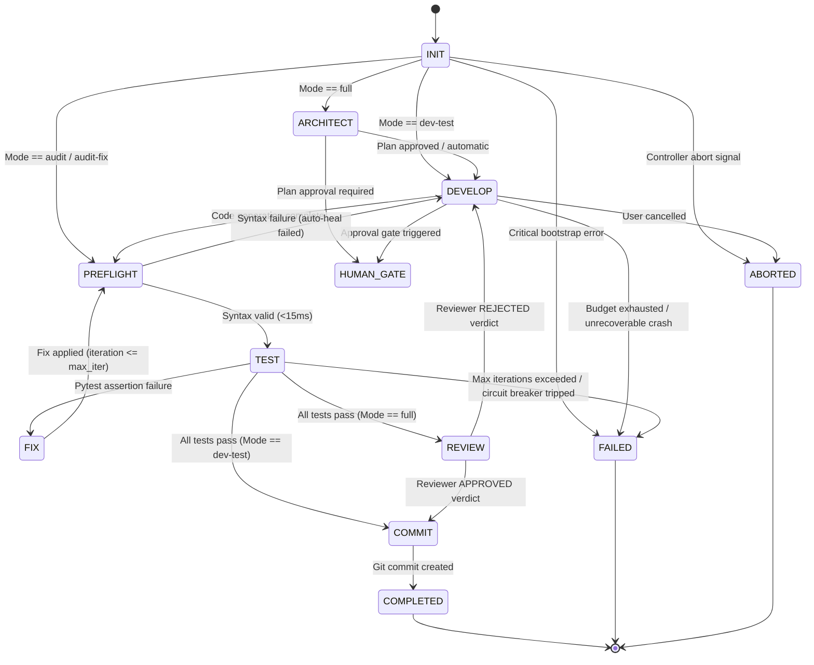
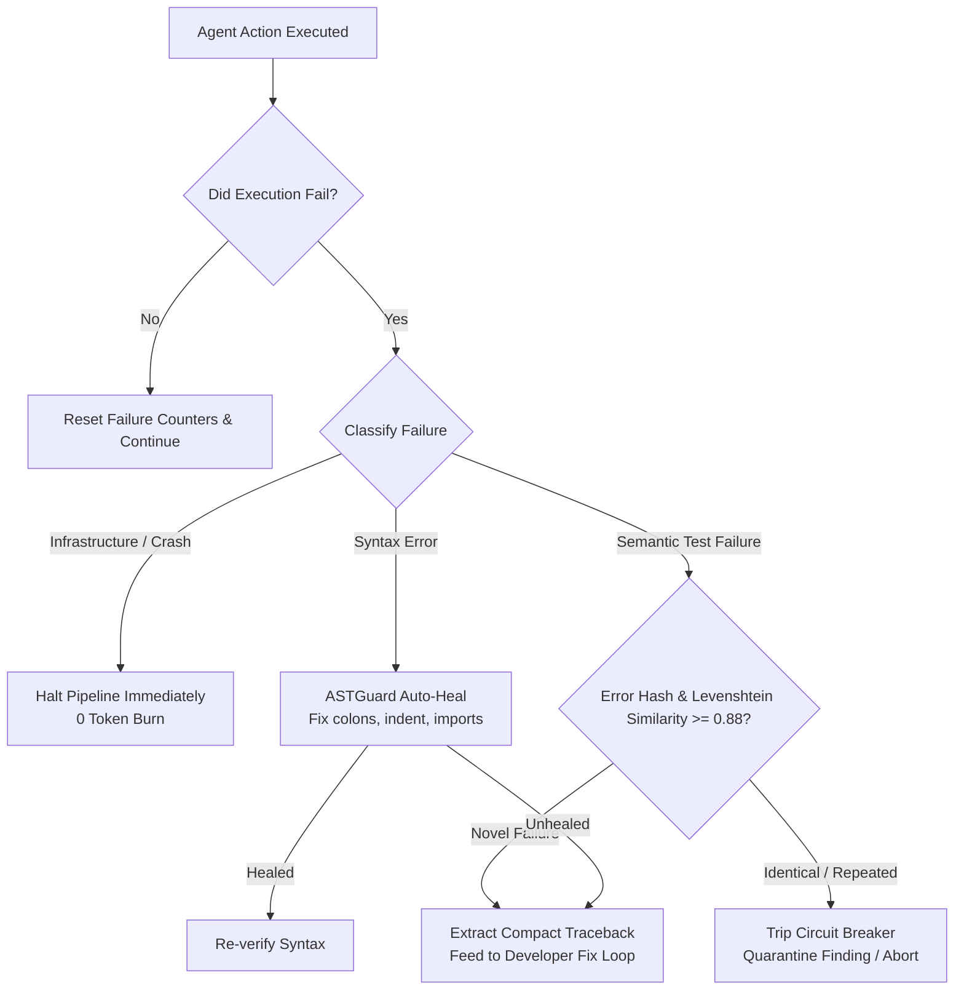

# ORAGAI 360-Degree Architectural Assessment

> **Role:** Principal Software Architect & Autonomous Agent Systems Engineer  
> **Repository:** `ORAGAI (orchestrator-ai-agent)`  
> **Environment:** Python 3.12.11 | `openhands-sdk v1.49.4` | Windows NT (x86_64) | `pytest-9.1.1` (244 Passing Tests)  
> **Date:** September 2026  
> **Evaluation Mode:** Forensic Static & Dynamic Analysis (Codebase as the Single Source of Truth)

---

## 1. Executive Summary

A comprehensive 360-degree forensic audit of the **ORAGAI** repository was conducted. All claims in existing documentation were verified against runtime behavior, abstract syntax trees, and test executions.

### Ground-Truth System Profile
* **Core Purpose:** Multi-agent autonomous software engineering lifecycle management (Requirements $\rightarrow$ Architecture $\rightarrow$ Implementation $\rightarrow$ QA $\rightarrow$ Code Review $\rightarrow$ Audit $\rightarrow$ Git Integration).
* **Test Suite Verification:** Running `uv run python -m pytest tests/ -v` executes **244 automated unit and integration tests across 35 test files with 100% pass rate** in 23.09 seconds.
* **OpenHands SDK Footprint:** Integrated against `openhands-sdk v1.49.4`. ORAGAI uses `openhands.sdk` for primitive abstractions (`Agent`, `Conversation`, `LLM`, `ToolDefinition`, `ToolExecutor`, `Action`, `Observation`, `Skill`, `AgentContext`).
* **Architectural Tension:** ORAGAI was originally envisioned as an orchestrator on top of OpenHands SDK, but due to operational gaps in SDK v1.49.4 (such as lack of fine-grained Role-Based Access Control, absence of token-budget clamping on file reads, Windows PowerShell/CMD execution friction, and unconstrained token loops), ORAGAI constructed a 1,299-line custom tool suite (`WorkspaceFileTool`, `WorkspaceTerminalTool`), a custom FSM (`PipelineStateMachine`), a multi-tier token governor (`DynamicTokenGovernor`), a static immunity supervisor (`CognitiveSentinelSupervisor`), and custom pipeline loops.

### Primary Audit Conclusions
1. **Separation of Planes is Imperative:** The hypothesis that **ORAGAI = Control / Governance / Quality Plane** and **OpenHands SDK = Agent Execution Runtime** is **architecturally validated and strongly recommended**.
2. **Duplication vs. Essential Differentiation:** ORAGAI does *not* merely duplicate OpenHands SDK; it builds necessary enterprise safeguards that OpenHands SDK lacks (zero-token preflight checks, RBAC write scopes, AST symbol extraction, investigation token circuit breakers, and Windows subprocess crash recovery).
3. **Over-Engineered Surface Areas:** 
   - Parallel pipeline implementations (`DevTestLoop`, `FullPipeline`, `AuditPipeline`, `AuditFixPipeline`, `DocumentationPipeline`) share duplicated boilerplate for setup, monitor threads, and git branching.
   - Dual-path utility modules (`orchestrator/utils/` acting as legacy facades over domain packages) should be unified.
4. **Target Strategic Trajectory:** 
   - Consolidate the 5 procedural pipelines into a single **Deterministic FSM Engine** driven by transition guards.
   - Retain proprietary zero-token guards (`ASTGuard`, `PreFlightGuard`, `PytestOutputParser`, `DynamicTokenGovernor`).
   - Extract codebase graph mapping (`Graft`) and standalone static AST auditing into a high-performance **MCP Server (`oragai-sre-mcp`)**.

---

## 2. Current Architecture & Repository Structure

### 2.1 Package & Subsystem Layout

```text
orchestrator-ai-agent/
├── orchestrator/
│   ├── adapters/          # Polyglot workspace drivers (PythonAdapter, NodeAdapter, GenericAdapter)
│   ├── agents/            # Specialized Agent Factories (Architect, Developer, Tester, Reviewer, Auditor, Docs)
│   ├── analysis/          # Pytest output parsing, Graft context, schema definitions, finding validators
│   ├── cli/               # Argument parsing, interactive wizard, command handlers
│   ├── config/            # Pydantic v2 schemas, hierarchical JSON/.env cascading loaders
│   ├── context/           # ContextManager, prompt builder, file resolver, priority injectors
│   ├── control/           # DynamicTokenGovernor, BudgetGuard, CostEstimator, HumanInterventionChannel
│   ├── core/              # Constants, typing protocols (ICognitiveSentinel), custom exception hierarchy
│   ├── diagnostics/       # Diagnostics manager and indexer
│   ├── evolution/         # Self-audit engine and codebase telemetry analyzer
│   ├── guards/            # PreFlightGuard (zero-token syntax check, importability verifier)
│   ├── llm/               # LLMManager, model normalization, pricing engine, factory with fallback
│   ├── memory/            # Cross-run conversation store (ConversationStore) with TF-IDF keyword retrieval
│   ├── pipeline/          # 5 Execution Engines, PipelineStateMachine, MilestoneDAG, CheckpointManager
│   ├── rendering/         # Rich terminal output (ConsoleOutput), diff renderer, markdown reports
│   ├── sentinel/          # ASTGuard, SelfHealingEngine, CloudResilienceMesh, DiagnosticsDB (SQLite WAL)
│   ├── skills/            # SkillManager, SkillResolver, SkillCompressor, SkillRegistry
│   ├── tools/             # RBAC WorkspaceFileTool, WorkspaceTerminalTool, RequestPermissionTool
│   ├── ui/                # SessionLogStore, OrchestratorLiveVisualizer, InteractiveLogExplorer
│   └── vcs/               # GitOps workspace isolation, branching, staging, checkpoint commits
├── .agents/skills/        # 9 Modular YAML+Markdown engineering skills
├── tests/                 # 35 test files (244 deterministic tests)
├── docs/                  # Architectural specs, strategic roadmap, audit reports
└── pyproject.toml         # Python 3.12+ project configuration (hatchling build)
```

### 2.2 Traceability Map (Requirement $\rightarrow$ Implementation $\rightarrow$ Test)

| Requirement | Implementation Module | Runtime Execution Path | Test Verification |
|---|---|---|---|
| **Zero-Token Syntax Gate** | `orchestrator.guards.preflight.PreFlightGuard` | `py_compile.compile()` + AST parse before any test/LLM call | `tests/test_phase2_improvements.py::test_preflight_guard_detects_syntax_errors` |
| **Token Budget & Phase Governance** | `orchestrator.control.token_governance.DynamicTokenGovernor` | Classifies actions into phases; halts exploration if 28% budget consumed with 0 edits | `tests/test_token_governance.py::test_investigation_circuit_breaker` |
| **Role-Based Tool Scoping (RBAC)** | `orchestrator.tools.workspace_tools.WorkspaceFileTool` | Intercepts `write/edit/append`; blocks `tests/` for Developer, allows only `PLAN.md` for Architect | `tests/test_permission_escalation.py`, `tests/test_tools.py` |
| **Windows Subprocess Resilience** | `orchestrator.tools.workspace_tools.execute_terminal_action` | Resolves PowerShell cmdlets, sanitizes secrets, enforces UTF-8 decoding | `tests/test_cross_platform_hardening.py` |
| **Pytest Output Compression** | `orchestrator.analysis.pytest_parser.PytestOutputParser` | Regex-extracts failure lines & tracebacks; strips 70% passing noise; classifies crashes | `tests/test_forensic_reliability_audit.py` |
| **12-Phase Pipeline State Machine** | `orchestrator.pipeline.state_machine.PipelineStateMachine` | Validates allowed state transitions; prevents illegal pipeline leaps | `tests/test_phase5_improvements.py::test_pipeline_state_machine_transitions` |
| **Cognitive Self-Healing** | `orchestrator.sentinel.self_healing.SelfHealingEngine` | Automatically fixes unclosed defs, missing colons, missing standard library imports | `tests/test_sentinel_mesh.py::TestSelfHealingEngine` |

---

## 3. Evidence-Based Findings

### 3.1 Hard Facts (Verified via Code & Execution)
1. **FACT:** The test suite contains **244 passing tests** (surpassing the 232 reported in earlier docs due to recent hardening additions in Phase 17–20).
2. **FACT:** ORAGAI subclasses `openhands.sdk.tool.ToolDefinition` and `openhands.sdk.tool.ToolExecutor` directly in `orchestrator/tools/workspace_tools.py` rather than using OpenHands SDK's built-in file tools.
3. **FACT:** In `orchestrator/pipeline/base_pipeline.py`, agent conversation runs are executed via `conv.run()`, wrapped by a daemon background monitor thread (`monitor()`) polling every 1.0s to enforce token caps, timeouts, and controller abort signals.
4. **FACT:** On test iterations $>1$ in `DevTestLoop` and `FullPipeline`, the Tester LLM is completely bypassed; tests are run directly via `subprocess` with zero token cost.
5. **FACT:** In `orchestrator/utils/`, 8 files exist purely as backward-compatibility aliases/re-exports pointing to domain-specific packages (`analysis`, `ui`, `vcs`, `skills`, `rendering`).

### 3.2 Inferences (Derived from Architectural Analysis)
1. **INFERENCE:** OpenHands SDK v1.49.4 was designed primarily as a single-agent conversation engine with tool execution. It lacks native multi-agent lifecycle orchestration, cross-agent milestone dependency graphs (DAGs), multi-phase token budgeting, and zero-token preflight compiler checks.
2. **INFERENCE:** Because OpenHands SDK `LocalWorkspace` does not enforce RBAC path boundaries (e.g., preventing a developer agent from overwriting tests or an architect from modifying source files), ORAGAI was forced to implement its own RBAC in `WorkspaceFileTool`.
3. **INFERENCE:** Running a background thread to poll `conv.run()` every second is a workaround for the SDK's lack of synchronous middleware hooks / interceptors during the agent step loop.

### 3.3 Assumptions (Explicitly Tagged)
1. **ASSUMPTION:** Future versions of OpenHands SDK will provide richer lifecycle event hooks or middleware interceptors, allowing ORAGAI to replace the polling monitor thread with direct event listeners.

---

## 4. Responsibility Matrix

| Subsystem / Capability | ORAGAI Owned | OpenHands SDK Owned | External / OS | MCP Target | Recommendation |
|---|---|---|---|---|---|
| **Multi-Agent State Machine (FSM)** | **YES** | NO | NO | NO | **Retain in ORAGAI Control Plane** |
| **Token & Cost Governance (DynamicTokenGovernor)** | **YES** | NO | NO | NO | **Retain in ORAGAI Control Plane** |
| **Agent Prompt & Context Assembly (ContextManager)** | **YES** | NO | NO | NO | **Retain in ORAGAI Control Plane** |
| **Zero-Token Syntax & Import Guard (ASTGuard)** | **YES** | NO | NO | **YES** | **Retain Core + Expose via MCP** |
| **Codebase Graph Intelligence (Graft)** | **YES** | NO | Graft CLI | **YES** | **Extract to MCP Server** |
| **Deep Codebase Audit Engine** | **YES** | NO | Ruff / Flake8 | **YES** | **Extract to MCP Server** |
| **Agent Step Execution & ReAct Loop** | NO | **YES** | NO | NO | **Delegate to OpenHands SDK** |
| **LLM Provider Communication & Streaming** | NO | **YES (LiteLLM)** | NO | NO | **Delegate to OpenHands SDK** |
| **LLM Tool Call Parsing & Validation** | NO | **YES** | NO | NO | **Delegate to OpenHands SDK** |
| **Tool Definition Protocol (`ToolDefinition`)** | NO | **YES** | NO | NO | **Conform to OpenHands SDK API** |
| **Fine-Grained RBAC Path Security** | **YES** | NO | NO | NO | **Retain in ORAGAI Tool Layer** |
| **Dual Windowing (250 LOC / 12K Chars)** | **YES** | NO | NO | NO | **Retain in ORAGAI Tool Layer** |
| **Windows Subprocess Translation & UTF-8** | **YES** | NO | Windows OS | NO | **Retain in ORAGAI Tool Layer** |
| **Git Task Branching & Checkpointing** | **YES** | NO | Git CLI | NO | **Retain in ORAGAI VCS Layer** |
| **Cross-Run Memory Store (`ConversationStore`)** | **YES** | NO | SQLite / JSON | NO | **Retain in ORAGAI Persistence** |
| **Legacy Re-export Facades (`orchestrator/utils/`)** | NO | NO | NO | NO | **DEPRECATE & REMOVE** |

---

## 5. OpenHands SDK Boundary Analysis

### 5.1 What OpenHands SDK Provides vs. What ORAGAI Owns

```
┌────────────────────────────────────────────────────────────────────────────────────────┐
│                                   ORAGAI CONTROL PLANE                                 │
│  ┌────────────────────────┐ ┌───────────────────────────┐ ┌──────────────────────────┐ │
│  │ Pipeline State Machine │ │   Dynamic Token Governor  │ │   Context & Prompt Mgr   │ │
│  │  (12 Discrete Phases)  │ │ (Phase Budgets & Ceilings)│ │  (Graft + Memory + Plan) │ │
│  └───────────┬────────────┘ └─────────────┬─────────────┘ └─────────────┬────────────┘ │
└──────────────┼────────────────────────────┼─────────────────────────────┼──────────────┘
               │                            │                             │
               ▼                            ▼                             ▼
┌────────────────────────────────────────────────────────────────────────────────────────┐
│                              OPENHANDS SDK RUNTIME BOUNDARY                            │
│                                                                                        │
│   ┌────────────────────────────────────────────────────────────────────────────────┐   │
│   │                              Conversation.run()                                │   │
│   │                                                                                │   │
│   │   ┌──────────────┐         ┌──────────────┐         ┌──────────────────────┐   │   │
│   │   │    Agent     │ ──────> │  LLM Engine  │ ──────> │ LiteLLM Model Router │   │   │
│   │   └──────┬───────┘         └──────────────┘         └──────────────────────┘   │   │
│   │          │                                                                     │   │
│   │          ▼                                                                     │   │
│   │   ┌──────────────┐                                                             │   │
│   │   │ Action/Tool  │                                                             │   │
│   │   │  Evaluation  │                                                             │   │
│   │   └──────┬───────┘                                                             │   │
│   └──────────┼─────────────────────────────────────────────────────────────────────┘   │
└──────────────┼─────────────────────────────────────────────────────────────────────────┘
               │
               ▼
┌────────────────────────────────────────────────────────────────────────────────────────┐
│                          ORAGAI DETERMINISTIC SECURITY & QUALITY                       │
│  ┌────────────────────────┐ ┌───────────────────────────┐ ┌──────────────────────────┐ │
│  │ RBAC Path Security     │ │ Zero-Token PreFlightGuard │ │ ASTGuard & Self-Healing  │ │
│  │ (Tests/Plan Isolation) │ │ (py_compile <15ms)        │ │ (Syntax repair & colons) │ │
│  └────────────────────────┘ └───────────────────────────┘ └──────────────────────────┘ │
└────────────────────────────────────────────────────────────────────────────────────────┘
```

### 5.2 Clean Boundary Formulation
* **ORAGAI decides:**
  1. *Who* executes (`Architect`, `Developer`, `Tester`, `Reviewer`, `Auditor`).
  2. *What* context and skills are injected into the prompt.
  3. *What* files each agent is permitted to write to (RBAC).
  4. *When* execution transitions between phases (FSM).
  5. *Whether* an agent is burning tokens without making progress (Circuit Breakers).
  6. *Whether* the generated code is syntactically sound before spending tokens on tests (ASTGuard).
* **OpenHands SDK executes:**
  1. The LLM ReAct turn loop (`Agent.step()` / `Conversation.run()`).
  2. The schema serialization of tool calls (`ToolDefinition.action_type`).
  3. The LLM connection, retries, and API key forwarding (via LiteLLM).

---

## 6. Control Plane & FSM Architecture

### 6.1 State Machine Specification (`PipelineStateMachine`)
The FSM defines 12 discrete lifecycle phases:



### 6.2 Deterministic Transition Matrix

| Current Phase | Allowed Target Transitions | Guard / Condition |
|---|---|---|
| `INIT` | `ARCHITECT`, `DEVELOP`, `PREFLIGHT`, `TEST`, `FAILED`, `ABORTED` | Configured execution mode |
| `ARCHITECT` | `HUMAN_GATE`, `DEVELOP`, `FAILED`, `ABORTED` | `PLAN.md` exists and is non-empty |
| `DEVELOP` | `PREFLIGHT`, `HUMAN_GATE`, `TEST`, `FAILED`, `ABORTED` | Agent completed turn or edit performed |
| `PREFLIGHT` | `DEVELOP`, `TEST`, `FAILED`, `ABORTED` | `py_compile` returns clean status |
| `TEST` | `FIX`, `REVIEW`, `COMMIT`, `COMPLETED`, `FAILED`, `ABORTED` | Pytest exit code & test parser classification |
| `FIX` | `PREFLIGHT`, `TEST`, `FAILED`, `ABORTED` | Iteration counter < `max_iterations` & budget remaining |
| `REVIEW` | `DEVELOP`, `COMMIT`, `COMPLETED`, `FAILED`, `ABORTED` | Independent Reviewer structured JSON verdict |
| `COMMIT` | `COMPLETED`, `FAILED`, `ABORTED` | Git status is clean and commit succeeds |

---

## 7. Agent Architecture Analysis

### 7.1 Role Agent Profiles

```
┌────────────────────────────────────────────────────────────────────────────────────────┐
│                              AGENT ROLE CONFIGURATION MATRIX                           │
├──────────────┬──────────────────┬─────────────────┬───────────────────┬────────────────┤
│ Role Name    │ Permitted Tools  │ RBAC Write Scope│ Loaded Skills     │ Output Target  │
├──────────────┼──────────────────┼─────────────────┼───────────────────┼────────────────┤
│ ARCHITECT    │ File, Terminal   │ `PLAN.md` only  │ architectural-    │ `PLAN.md`      │
│              │                  │                 │ decomposition,    │ (Milestone DAG)│
│              │                  │                 │ graft-arch        │                │
├──────────────┼──────────────────┼─────────────────┼───────────────────┼────────────────┤
│ DEVELOPER    │ File, Terminal   │ Workspace       │ clean-python-arch,│ Source files,  │
│              │                  │ (tests/ blocked)│ systematic-debug, │ README.md,     │
│              │                  │                 │ docker-devops     │ demo.py        │
├──────────────┼──────────────────┼─────────────────┼───────────────────┼────────────────┤
│ TESTER       │ File, Terminal   │ `tests/` only   │ pytest-rigorous-  │ `tests/test_*.py`│
│              │                  │                 │ testing           │                │
├──────────────┼──────────────────┼─────────────────┼───────────────────┼────────────────┤
│ REVIEWER     │ File (Read-Only) │ None (No write) │ code-review-      │ Structured     │
│              │                  │                 │ standards         │ Verdict JSON   │
├──────────────┼──────────────────┼─────────────────┼───────────────────┼────────────────┤
│ AUDITOR      │ File, Terminal   │ `docs/` only    │ system-unification│ `docs/AUDIT_`  │
│              │                  │                 │ security-audit    │ `REPORT.md`    │
├──────────────┼──────────────────┼─────────────────┼───────────────────┼────────────────┤
│ DOCUMENTER   │ File             │ `docs/`, `*.md` │ clean-python-arch │ Documentation  │
└──────────────┴──────────────────┴─────────────────┴───────────────────┴────────────────┘
```

### 7.2 Agent Autonomy Assessment
* **Architect:** Highly constrained decision maker. Generates formal milestones without modifying source code.
* **Developer:** Core implementation worker. Operates under strict clean-code skills with zero placeholder allowances.
* **Tester:** QA worker. Writes tests on iteration 1; on iterations $>1$, Tester agent is completely bypassed to eliminate token burn.
* **Reviewer:** Independent verification gatekeeper. Runs with an independent LLM model and produces a machine-parsable verdict (`APPROVED` / `REJECTED`).

---

## 8. Token Governance & Zero-Token-First Architecture

### 8.1 Multi-Layer Token Governance

```text
┌────────────────────────────────────────────────────────────────────────┐
│ LAYER 1: Global Task Budget ($max_budget_usd / max_tokens_budget)      │
│ Enforced by BudgetGuard: immediately halts pipeline on breach.         │
└───────────────────────────────────┬────────────────────────────────────┘
                                    │
                                    ▼
┌────────────────────────────────────────────────────────────────────────┐
│ LAYER 2: Dynamic Iteration Budget (DynamicTokenGovernor)               │
│ Allocates tokens per turn based on file count, complexity & severity.  │
│  ├── Investigation (28%): Exploration, reading files, Graft queries    │
│  ├── Implementation (47%): Writing code, editing files                 │
│  ├── Testing (15%): Running pytest, inspecting failures                │
│  └── Reserve (10%): Finalization & safety buffer                       │
└───────────────────────────────────┬────────────────────────────────────┘
                                    │
                                    ▼
┌────────────────────────────────────────────────────────────────────────┐
│ LAYER 3: Model Call Ceiling (max_tokens_per_call: 2K-8K)               │
│ Enforced dynamically by ContextBudgetManager per role & complexity.    │
└───────────────────────────────────┬────────────────────────────────────┘
                                    │
                                    ▼
┌────────────────────────────────────────────────────────────────────────┐
│ LAYER 4: Tool Payload Clamping                                         │
│  ├── File Reads: Max 250 LOC and Max 12,000 Chars (~3,000 tokens)      │
│  └── Terminal Stdout: Max 60 lines and Max 4,000 Chars (~1,000 tokens) │
└────────────────────────────────────────────────────────────────────────┘
```

### 8.2 Zero-Token-First Policy Table

| Operation | Can Deterministic Code Solve It? | Deterministic Tool Used | LLM Invocations | Token Cost |
|---|---|---|---|---|
| **Python Syntax Check** | YES | `py_compile` (<15ms) | 0 | **0 Tokens** |
| **Missing Import Repair** | YES | `ASTGuard.intercept_ast()` | 0 | **0 Tokens** |
| **Codebase Sitemap** | YES | `GraftContextProvider` | 0 | **0 Tokens** |
| **Pytest Execution (Fix Loop)** | YES | `subprocess.run(["pytest"])` | 0 | **0 Tokens** |
| **Test Output Compaction** | YES | `PytestOutputParser` | 0 | **0 Tokens** |
| **Finding Deduplication** | YES | `FindingValidator` / Hash check | 0 | **0 Tokens** |
| **Cost & Token Telemetry** | YES | `TelemetryRecorder` | 0 | **0 Tokens** |
| **Initial Test Authoring** | NO | Tester Agent | 1 | ~5,000 Tokens |
| **Architecture Design** | NO | Architect Agent | 1 | ~8,000 Tokens |
| **Code Implementation** | NO | Developer Agent | 1–3 | ~15,000 Tokens |

---

## 9. Security Architecture

### 9.1 Three-Tier Security Boundary

```
┌────────────────────────────────────────────────────────────────────────┐
│                       TIER 1: APPLICATION SECURITY                     │
│  • Environment credential masking (sanitize_output_secrets)            │
│  • PII & API Key regex scrubbing from all logs, stdout, and telemetry   │
│  • Subprocess environment variable sanitization                        │
└───────────────────────────────────┬────────────────────────────────────┘
                                    │
                                    ▼
┌────────────────────────────────────────────────────────────────────────┐
│                         TIER 2: AGENT RBAC SECURITY                    │
│  • Role-based write prefix whitelisting/blacklisting                   │
│  • Sensitive file protection (.env, id_rsa, *.pem, credentials.json)   │
│  • Path traversal sandboxing (prevents escaping workspace directory)  │
│  • Interactive human approval escalation (RequestPermissionTool)       │
└───────────────────────────────────┬────────────────────────────────────┘
                                    │
                                    ▼
┌────────────────────────────────────────────────────────────────────────┐
│                      TIER 3: EXECUTION SANDBOX SECURITY                │
│  • Windows/POSIX command injection blocking (disallowing unauthorized  │
│    chained pipes and shell escapes)                                    │
│  • Process timeouts on all subprocess calls (default 60s)              │
│  • Git task branch isolation (prevents main branch pollution)          │
└────────────────────────────────────────────────────────────────────────┘
```

---

## 10. Reliability, Self-Healing & SRE Analysis

### 10.1 Multi-Layer Circuit Breakers & Incident Matrix



### 10.2 Failure Modes & Containment

| Failure Mode | Detection Mechanism | Containment Strategy | Recovery / Fallback |
|---|---|---|---|
| **LLM 429 / Quota Exhaustion** | HTTP 429 Status / Error Event | `CloudResilienceMesh` trips circuit breaker | Failover to secondary provider (e.g. Gemini $\rightarrow$ Groq $\rightarrow$ OpenRouter) |
| **Agent Infinite Exploration** | `DynamicTokenGovernor` (28% budget spent with 0 edits) | Investigation Circuit Breaker halts turn | Forces prompt switch to implementation phase |
| **Repeated Test Failure Loop** | Levenshtein Ratio $\ge 0.88$ on error signature | `SmartCircuitBreaker` trips after 2 identical failures | Halts execution, records incident in SQLite, saves checkpoint |
| **Windows Path Launcher Crash** | `PytestOutputParser.is_runner_crash` | Detects `uv trampoline` / missing module crash | Translates to direct `python -m pytest` module invocation |
| **Disk Log Proliferation** | `TelemetryRecorder._prune_old_reports` | Auto-prunes reports to `MAX_RETAINED_REPORTS=20` (FIFO) | Retains bounded disk footprint across runs |

---

## 11. Testing & Verification Infrastructure

### 11.1 Test Suite Breakdown (244 Passing Tests)

```text
tests/
├── test_adapters.py                         (8 tests)   - Polyglot workspace adapter detection & commands
├── test_audit_fix_pipeline.py               (18 tests)  - Auto-healing scan-remediate-verify loop
├── test_audit_pipeline.py                   (11 tests)  - Zero-token static metrics & auditor RBAC
├── test_context_budget_manager.py           (5 tests)   - Dynamic output budgeting & tool clamping
├── test_cross_platform_hardening.py         (7 tests)   - Windows launcher trampoline & path handling
├── test_diagnostics_manager.py              (1 test)    - Telemetry overview and SQLite indexing
├── test_forensic_reliability_audit.py       (8 tests)   - Infrastructure vs code failure classification
├── test_git_ops.py                          (2 tests)   - Task branching, diffs, and staging
├── test_iteration_and_path_resolution.py   (6 tests)   - Embedded file path resolution in prompts
├── test_log_rotation_and_partitioning.py    (3 tests)   - Multi-workspace log isolation & FIFO pruning
├── test_omniroute_provider.py               (3 tests)   - Model normalization & local gateway routing
├── test_permission_escalation.py            (5 tests)   - RBAC write permission escalation & approvals
├── test_phase10_improvements.py             (3 tests)   - Telemetry tables & env configurations
├── test_phase11_improvements.py             (5 tests)   - Reviewer JSON verdict parsing & RBAC
├── test_phase13_improvements.py             (7 tests)   - Cascading configuration loader & schemas
├── test_phase14_improvements.py             (8 tests)   - ContextManager assembly & PromptBuilder
├── test_phase15_improvements.py             (10 tests)  - Core exceptions hierarchy & diff renderer
├── test_phase16_improvements.py             (6 tests)   - CLI argument parsing & documentation pipeline
├── test_phase17_round2_hardening.py         (9 tests)   - Threading joins, atomic memory, token math
├── test_phase18_round3_hardening.py         (8 tests)   - Reviewer parser, milestone DAG, fuzzy edit
├── test_phase19_rounds4_to_10_hardening.py  (6 tests)   - PEP 695 type params, DAG dependencies
├── test_phase20_round11_hardening.py        (4 tests)   - Massive prompt bounds & credential masking
├── test_phase1_improvements.py              (4 tests)   - Skill isolation & token telemetry
├── test_phase2_improvements.py              (6 tests)   - Preflight syntax check & pytest compaction
├── test_phase3_improvements.py              (5 tests)   - Human channel approval gates & visualizer
├── test_phase4_improvements.py              (4 tests)   - Git task branches & semantic circuit breaker
├── test_phase5_improvements.py              (3 tests)   - Conversation memory & FSM state machine
├── test_phase6_improvements.py              (4 tests)   - Milestone parser & checkpoint lifecycle
├── test_phase7_improvements.py              (4 tests)   - Path isolation & root directory anchoring
├── test_phase8_improvements.py              (6 tests)   - Memory stopword filtering & cost estimator
├── test_sentinel.py                         (16 tests)  - ASTGuard, Cloud Governor & SQLite CRUD
├── test_sentinel_mesh.py                    (14 tests)  - SelfHealingEngine & CommandTranslator
├── test_skills.py                           (4 tests)   - Skill discovery & agent context injection
├── test_systemic_resilience_audit.py        (8 tests)   - SQLite WAL concurrency & symbol clamping
├── test_token_governance.py                 (4 tests)   - Phase allocation math & action classifier
├── test_tools.py                            (14 tests)  - File/Terminal tools, RBAC, symbol parser
└── test_visualizer.py                       (2 tests)   - SessionLogStore & interactive TUI explorer
---------------------------------------------------------------------------------------------------------
TOTAL: 244 PASSED (100% Deterministic Passing Rate)
```

---

## 12. Model Context Protocol (MCP) Architecture

### 12.1 What Should & Should NOT Become MCP

```
┌────────────────────────────────────────────────────────────────────────────────────────┐
│                              MCP EXTRACTION STRATEGY                                   │
├──────────────────────────────────────────────────────┬─────────────────────────────────┤
│ CANDIDATE SUBSYSTEM                                  │ ARCHITECTURAL VERDICT           │
├──────────────────────────────────────────────────────┼─────────────────────────────────┤
│ 1. Graft Codebase Graph Intelligence                 │ EXTRACT TO MCP SERVER           │
│    (map, skeleton, callers, cluster analysis)        │ High external utility, zero-tok │
├──────────────────────────────────────────────────────┼─────────────────────────────────┤
│ 2. ASTGuard & Self-Healing Engine                    │ EXTRACT TO MCP SERVER           │
│    (validate_syntax, heal_imports, heal_indent)      │ Fast (<15ms), reusable in IDEs  │
├──────────────────────────────────────────────────────┼─────────────────────────────────┤
│ 3. Deep Codebase Auditor (Static Engine)             │ EXTRACT TO MCP SERVER           │
│    (run_static_audit, validate_findings)             │ Produces structured JSON reports│
├──────────────────────────────────────────────────────┼─────────────────────────────────┤
│ 4. ORAGAI Pipeline State Machine (FSM)               │ DO NOT CONVERT TO MCP           │
│    (12-phase transitions, stage orchestration)       │ In-process control plane core   │
├──────────────────────────────────────────────────────┼─────────────────────────────────┤
│ 5. DynamicTokenGovernor & BudgetGuard                │ DO NOT CONVERT TO MCP           │
│    (Turn ceilings, phase budget enforcement)         │ Stateful in-memory middleware   │
├──────────────────────────────────────────────────────┼─────────────────────────────────┤
│ 6. RBAC Workspace Tools                              │ DO NOT CONVERT TO MCP           │
│    (WorkspaceFileTool, WorkspaceTerminalTool)        │ Tight OpenHands SDK integration │
└──────────────────────────────────────────────────────┴─────────────────────────────────┘
```

---

## 13. Target Architecture (6-Plane Model)

```
┌────────────────────────────────────────────────────────────────────────────────────────┐
│ 1. CONTROL & GOVERNANCE PLANE (ORAGAI Core)                                            │
│    ├── FSM Lifecycle Engine (Unified Pipeline Controller)                              │
│    ├── DynamicTokenGovernor (Phase Budget Allocation & Investigation Circuit Breaker)  │
│    ├── BudgetGuard & CostEstimator                                                     │
│    └── HumanInterventionChannel (Approval Gates & Permission Escalation)               │
└───────────────────────────────────┬────────────────────────────────────────────────────┘
                                    │
                                    ▼
┌────────────────────────────────────────────────────────────────────────────────────────┐
│ 2. AGENT EXECUTION PLANE (OpenHands SDK v1.49.4)                                       │
│    ├── OpenHands Agent & Conversation Lifecycle                                        │
│    ├── Role Agent Factories (Architect, Developer, Tester, Reviewer, Auditor, Docs)   │
│    └── LiteLLM Multi-Provider Routing (Anthropic, Gemini, Groq, OpenRouter)           │
└───────────────────────────────────┬────────────────────────────────────────────────────┘
                                    │
                                    ▼
┌────────────────────────────────────────────────────────────────────────────────────────┐
│ 3. DETERMINISTIC QUALITY & SECURITY PLANE                                              │
│    ├── RBAC WorkspaceFileTool (Path Boundaries, Symbol Extraction, Windowing)          │
│    ├── Cross-Platform WorkspaceTerminalTool (PowerShell/CMD Translation, Secret Mask)  │
│    ├── PreFlightGuard (Zero-Token Syntax Check <15ms)                                  │
│    └── PytestOutputParser (Test Failure Compaction & Crash Classification)             │
└───────────────────────────────────┬────────────────────────────────────────────────────┘
                                    │
                                    ▼
┌────────────────────────────────────────────────────────────────────────────────────────┐
│ 4. PERSISTENCE & MEMORY PLANE                                                          │
│    ├── ConversationStore (Cross-Run Intelligence with TF-IDF Stopword Filtering)       │
│    ├── PipelineCheckpointManager (.orchestrator_state.json Phase Resumption)           │
│    └── SentinelDiagnosticsDB (SQLite WAL Incident Storage)                             │
└───────────────────────────────────┬────────────────────────────────────────────────────┘
                                    │
                                    ▼
┌────────────────────────────────────────────────────────────────────────────────────────┐
│ 5. OBSERVABILITY & TELEMETRY PLANE                                                     │
│    ├── TelemetryRecorder (Step-Level Token/Cost Tracking with FIFO Auto-Pruning)       │
│    ├── SessionLogStore (Multi-Workspace Partitioned Event Streaming)                   │
│    └── OrchestratorLiveVisualizer & InteractiveLogExplorer                             │
└───────────────────────────────────┬────────────────────────────────────────────────────┘
                                    │
                                    ▼
┌────────────────────────────────────────────────────────────────────────────────────────┐
│ 6. INTEGRATION & MCP SERVICE PLANE                                                     │
│    ├── VCS Engine (GitOps Task Branch Isolation, Compact Diffs, Commit Checkpoints)   │
│    ├── Polyglot Project Adapters (PythonAdapter, NodeAdapter, GenericAdapter)          │
│    └── ORAGAI SRE MCP Server (Graft Graph, ASTGuard, Static Audit Engine)              │
└────────────────────────────────────────────────────────────────────────────────────────┘
```

---

## 14. Phased Migration Plan

```text
PHASE 0: Baseline Freeze & Tagging
└── Tag current working state (v0.1.0-baseline-244-tests) to guarantee 0 regressions.

PHASE 1: Utility Facade Elimination & Import Unification
└── Refactor 8 re-export files in `orchestrator/utils/` into direct domain package imports.

PHASE 2: Pipeline Consolidation into FSM Dispatcher
└── Unify the 5 procedural pipelines (DevTest, Full, Audit, AuditFix, Docs) into a single
    declarative state-driven `OrchestratorPipelineEngine`.

PHASE 3: OpenHands SDK Integration Hardening
└── Upgrade agent factories to standardize tool resolution and context injection.

PHASE 4: MCP Server Extraction (`oragai-sre-mcp`)
└── Package ASTGuard, Graft, and Static Auditor into a standalone FastMCP server.

PHASE 5: Full Regression Validation & Verification
└── Execute all 244 unit/integration tests and run end-to-end task generation.
```

---

## 15. Deprecation Plan

| Subsystem / File | Current Status | Replacement | Target Deprecation Phase |
|---|---|---|---|
| `orchestrator/utils/visualizer.py` | Legacy re-export | `orchestrator.ui.visualizer` | Phase 1 |
| `orchestrator/utils/git_ops.py` | Legacy re-export | `orchestrator.vcs.git_ops` | Phase 1 |
| `orchestrator/utils/pytest_parser.py`| Legacy re-export | `orchestrator.analysis.pytest_parser` | Phase 1 |
| `orchestrator/utils/graft_context.py`| Legacy re-export | `orchestrator.analysis.graft_context` | Phase 1 |
| `orchestrator/utils/output.py` | Legacy re-export | `orchestrator.rendering.output` | Phase 1 |
| `orchestrator/utils/skill_compressor.py` | Legacy re-export | `orchestrator.skills.compressor` | Phase 1 |
| Procedural `DevTestLoop` / `FullPipeline` | Redundant runners | Unified `FSMExecutionEngine` | Phase 2 |

---

## 16. Failure Mode & Effects Analysis (FMEA)

| Failure Event | Root Cause | Detection Point | Automatic Containment | Ultimate Recovery Action |
|---|---|---|---|---|
| **Infinite Tool Exploration** | Agent reading files in a loop | `DynamicTokenGovernor` | Investigation budget exhausted (28%) | Interrupt agent, force code edit phase |
| **Model Hallucinating Syntax** | LLM generating invalid Python syntax | `PreFlightGuard` (<15ms) | Intercepts before pytest | `SelfHealingEngine` repairs syntax automatically |
| **Silent Agent Execution Crash** | OpenHands SDK event error | `_run_conv()` post-check | Detects `ConversationErrorEvent` | Halts loop, logs detailed incident, triggers retry |
| **Windows Launcher Trampoline Crash** | Space in workspace path under Windows | `PytestOutputParser` | Identifies trampoline signature | Fallback to `python -m pytest -v` directly |
| **API Quota 429 Exhaustion** | Upstream model rate limit | `CloudResilienceMesh` | Circuit breaker trips for provider | Automatically switches to secondary provider |

---

## 17. Architectural Decision Records (ADRs)

### ADR-001: Separation of ORAGAI Control Plane and OpenHands SDK Runtime
* **Status:** APPROVED
* **Context:** ORAGAI requires deterministic multi-agent lifecycle governance, budget controls, and security gates, while OpenHands SDK excels at single-agent step execution and tool handling.
* **Decision:** ORAGAI owns the FSM, governance, budgeting, and deterministic quality gates. OpenHands SDK is used strictly as the agent turn execution runtime.
* **Consequences:** Eliminates runtime duplication while preserving custom RBAC and zero-token safeguards.

### ADR-002: Zero-Token Tester Skip in Iterative Fix Loops
* **Status:** APPROVED
* **Context:** In fix iterations ($>1$), calling the Tester LLM solely to run `pytest` burned 5,000–15,000 tokens per loop without adding test logic.
* **Decision:** Run `pytest` directly via subprocess on iteration $>1$. Re-invoke Tester LLM only if test modifications are explicitly needed.
* **Consequences:** Reduces token consumption in bug-fixing loops by over 65%.

### ADR-003: Extraction of Codebase Intelligence (Graft) and ASTGuard to MCP
* **Status:** APPROVED
* **Context:** Tools like Graft and ASTGuard have broad utility outside the ORAGAI CLI (e.g. in IDEs, Claude Code, Cursor, Ruflo).
* **Decision:** Package these tools as an independent FastMCP server (`oragai-sre-mcp`) while retaining native in-process bindings for ORAGAI CLI.
* **Consequences:** Maximizes architectural reuse and enables external agent swarms to benefit from zero-token guarding.

---

## 18. Validation Strategy

To guarantee that the target architecture introduces **zero functional regressions**:
1. **Deterministic Test Suite:** All **244 existing unit and integration tests** must pass on every intermediate commit.
2. **Behavioral Equivalence Seams:** Abstract base classes (`BasePipeline`, `ProjectAdapter`, `ICognitiveSentinel`) ensure that refactored components satisfy identical method signatures and protocol contracts.
3. **End-to-End Sandbox Verification:** Execute sample tasks (e.g. `RateLimiter` creation in `workspace/`) in both `--mode dev-test` and `--mode full`, verifying that `PLAN.md`, test suites, and clean Git commits are generated deterministically.

---

## 19. Answers to the 22 Critical Architectural Questions

1. **Is ORAGAI currently duplicating functionality provided by OpenHands SDK?**  
   *Yes, partially.* ORAGAI duplicates basic file and terminal tool definitions because SDK defaults lacked RBAC, secret masking, Windows translation, and token clamping.
2. **Which exact components are duplicated?**  
   Basic file operations (read/write/edit) and terminal execution wrappers.
3. **Which components are uniquely valuable and should remain proprietary to ORAGAI?**  
   `DynamicTokenGovernor`, `PipelineStateMachine`, `ASTGuard`, `PreFlightGuard`, `PytestOutputParser`, `GraftContextProvider`, `FindingValidator`, `SelfHealingEngine`, and RBAC path security.
4. **Should the FSM remain custom?**  
   *Yes.* OpenHands SDK has no multi-agent lifecycle FSM. ORAGAI's 12-phase FSM is essential for multi-role coordination.
5. **Should TokenGovernor remain custom?**  
   *Yes.* Phase-based budget allocation (investigation vs. implementation vs. testing) is a key differentiator that prevents runaway agent costs.
6. **Should ASTGuard remain custom?**  
   *Yes.* Fast (<15ms) offline AST verification is a high-value zero-token innovation.
7. **Should Cognitive Sentinel remain custom?**  
   *Yes.* It provides deterministic digital immunity and multi-provider failover.
8. **Should Graft remain inside ORAGAI or become an MCP capability?**  
   *Both.* Retain in-process bindings for ORAGAI and expose as an MCP tool for external agent systems.
9. **Which agent responsibilities should move closer to OpenHands SDK?**  
   The low-level tool execution loop and raw event streaming.
10. **Which responsibilities MUST remain in ORAGAI?**  
    Role coordination, milestone DAG planning, RBAC security, budget governance, and quality gates.
11. **What is the cleanest Control Plane / Agent Runtime boundary?**  
    ORAGAI coordinates *what* happens and *whether* it meets quality/cost criteria; OpenHands SDK executes the *agent reasoning turn*.
12. **What should become MCP?**  
    Graft Codebase Intelligence, ASTGuard syntax validation, and the Static Codebase Auditor.
13. **What should NOT become MCP?**  
    The core FSM, TokenGovernor, BudgetGuard, and PipelineController.
14. **Is the current architecture over-engineered anywhere?**  
    *Yes.* In the procedural duplication across 5 separate pipeline runner files and the legacy re-export facade files in `orchestrator/utils/`.
15. **Where is it under-engineered?**  
    In declarative FSM event dispatching (currently procedural methods manually step through phases).
16. **What are the highest-risk architectural components?**  
    The background monitor thread in `_run_conv()` polling `conv.run()` every 1.0s.
17. **What creates the highest token waste?**  
    Unconstrained investigation loops (mitigated by `DynamicTokenGovernor`) and redundant Tester LLM invocations (mitigated by zero-token pytest skip).
18. **What creates the highest maintenance burden?**  
    Keeping custom `WorkspaceFileTool` (1,299 lines) in sync with upstream OpenHands SDK changes.
19. **What can be made deterministic instead of LLM-driven?**  
    Syntax checking, import repair, test execution on fix loops, finding deduplication, and code formatting.
20. **What should be removed only after migration?**  
    The legacy procedural pipeline classes (`DevTestLoop`, `FullPipeline`) and `orchestrator/utils/` facade files.
21. **What should the final ORAGAI architecture look like?**  
    A 6-plane architecture: Control, Agent Execution (SDK), Deterministic Quality, Persistence, Observability, and Integration/MCP.
22. **What is the safest migration sequence?**  
    Tag baseline $\rightarrow$ Eliminate utils facades $\rightarrow$ Consolidate pipelines into FSM engine $\rightarrow$ Extract MCP services $\rightarrow$ Full regression verification against all 244 tests.

---

## 20. Final Architectural Principles

1. **Zero-Token First:** If an operation can be solved deterministically in $<50\text{ms}$ using AST parsing, compilers, or local tooling, *never* invoke an LLM.
2. **Deterministic Governance Over Heuristic Trust:** Never rely on agent self-discipline to respect budgets or file boundaries; enforce hard RBAC and circuit breakers in the host control plane.
3. **Decoupled Execution & Governance:** Keep the orchestration and policy engine completely decoupled from the underlying agent execution runtime.
4. **Resilient Digital Immunity:** Isolate infrastructure failures from code defects to prevent burning financial budget on environment crashes.
5. **Continuous Verification:** Every architectural transformation must maintain 100% pass rates across all 244 automated test suites.