# P13 — FINAL ORAGAI TARGET ARCHITECTURE SPECIFICATION
## The Definitive Clean / Hexagonal (Ports & Adapters) Master Blueprint

---

### Executive Metadata
- **Document ID:** `ORAGAI-ARCH-P13-CANONICAL`
- **Status:** `APPROVED / MASTER SPECIFICATION`
- **Classification:** Enterprise Architectural Blueprint & Canonical System Standard
- **Scope:** Complete `orchestrator-ai-agent` Architecture, Package Layout, Data Models, Protocols, and Verification Harness
- **Target Implementation Base:** Clean / Hexagonal Architecture (Ports & Adapters) with Inversion of Control (IoC)
- **Runtime Engine:** OpenHands SDK v1.49.4 (Ephemeral, Subordinate, Zero-Patching)
- **Author:** Principal Enterprise Systems Architect & Chief Systems Engineer

---

## 1. Executive Summary & Architectural Vision

### 1.1 The Target Paradigm: An Autonomous Software Engineering Factory
The ORAGAI multi-agent software engineering orchestrator (`orchestrator-ai-agent`) is an **Autonomous Software Engineering Factory** designed to execute complex, multi-file software engineering tasks with mathematical determinism, zero regressions, and absolute verifiable correctness.

Traditional multi-agent frameworks suffer from critical systemic failure modes:
1. **Agent Flattery & Self-Certification:** Large Language Models (LLMs) declaring tasks complete based on conversational affirmations rather than cryptographically verifiable test evidence.
2. **Context Degradation & Amnesia:** Loss of requirements, architecture contracts, and prior verification states across long-running turns.
3. **Infinite Loops & Stagnation:** Unbounded trial-and-error without mathematical velocity tracking or progressive strategy mutation.
4. **Brittle Runtime Coupling:** Intrusive monkey-patching of third-party execution frameworks, causing high maintenance friction and silent breakage.
5. **Architectural Erosion:** Incremental code modification that introduces circular imports, god objects, security vulnerabilities, or empty stub implementations (`pass`, `TODO`, `NotImplementedError`).

ORAGAI solves these failure modes by enforcing **Hexagonal Architecture (Ports & Adapters)** and strict **Inversion of Control (IoC)** across two strictly separated planes: the **Control/Governance Plane** and the **Execution Runtime Plane**.

```
┌──────────────────────────────────────────────────────────────────────────────────────────────────┐
│                                     ORAGAI DUAL-PLANE TOPOLOGY                                   │
├───────────────────────────────────────────────────┬──────────────────────────────────────────────┤
│              CONTROL & GOVERNANCE PLANE           │            EXECUTION RUNTIME PLANE           │
│                    (Pure ORAGAI)                  │             (OpenHands SDK v1.49.4)          │
├───────────────────────────────────────────────────┼──────────────────────────────────────────────┤
│ • Master Task Truth Graph (Immutable DAG)         │ • Ephemeral Agent Worker Turns (k <= B_turns) │
│ • Guarded Finite State Machine (IoC Lifecycle)    │ • Subordinate ReAct Execution Loop           │
│ • Deterministic Completion Gates & Cryptography   │ • Tool Call Invocations (AST Sandbox)        │
│ • Real-time 4D Velocity & Stagnation Damping      │ • Zero Global State Ownership                │
│ • Zero-Token Static Audit & Codebase Health (CHI) │ • Zero Lifecycle Authority                   │
│ • Adaptive Resource & Token Budget Allocator      │ • Zero Direct Disk/VCS Mutation Control      │
└───────────────────────────────────────────────────┴──────────────────────────────────────────────┘
```

### 1.2 The Definitive Separation of Planes
1. **The Control/Governance Plane (ORAGAI Core):**
   - Holds absolute ownership over task truth, lifecycle progression, state transitions, security boundary enforcement, budget allocation, evidence verification, and VCS checkpoints.
   - Evaluates whether requirements are met purely through deterministic, content-hashed evidence ($FCR \equiv 0.000$).
   - Never allows an LLM agent to certify its own completion or transition the system state directly.

2. **The Execution Runtime Plane (OpenHands SDK Adapter):**
   - Functions strictly as a subordinate, ephemeral execution engine invoked by the Control Plane.
   - Operates within strictly bounded turn envelopes ($\mathcal{B}_{\text{turns}}$, $\mathcal{B}_{\text{tokens}}$, $\mathcal{B}_{\text{dollars}}$).
   - Interacts with the filesystem and shell exclusively through ORAGAI's hardened AST and grammar-checked tool ports.
   - Retains zero state across orchestrator lifecycle phases.

---

## 2. Unified Hexagonal Architecture Topology (Ports & Adapters)

### 2.1 The Hexagonal Topology Map

```
                                  =======================================
                                  ||        INBOUND DRIVING PORTS      ||
                                  =======================================
                                                     │
               ┌─────────────────────────────────────┼─────────────────────────────────────┐
               ▼                                     ▼                                     ▼
     ┌──────────────────┐                  ┌──────────────────┐                  ┌──────────────────┐
     │CLIControllerPort │                  │ FSMTriggerPort   │                  │PipelineDisp.Port │
     └─────────┬────────┘                  └─────────┬────────┘                  └─────────┬────────┘
               │                                     │                                     │
               └─────────────────────────────────────┼─────────────────────────────────────┘
                                                     ▼
     ╔═══════════════════════════════════════════════════════════════════════════════════════════════╗
     ║                                 APPLICATION & WORKSTREAM LAYER                                ║
     ║  ┌───────────────────────┐  ┌───────────────────────┐  ┌───────────────────────────────────┐  ║
     ║  │  MicroTDDWorkstream   │  │ MilestoneDAGWorkstream│  │     ContextSynthesisWorkstream    │  ║
     ║  │ (Red-Green-Refactor)  │  │  (Topological Solver) │  │  (Tiers 0-3 / Token Distributor)  │  ║
     ║  └───────────┬───────────┘  └───────────┬───────────┘  └─────────────────┬─────────────────┘  ║
     ║              │                          │                                │                    ║
     ║  ┌───────────┴───────────┐  ┌───────────┴───────────┐  ┌─────────────────┴─────────────────┐  ║
     ║  │ StaticAuditWorkstream │  │ CodeReviewWorkstream  │  │    StagnationRecoveryWorkstream   │  ║
     ║  │  (Zero-Token Sweeps)  │  │(Monotonic Quality Gate│  │ (4D Velocity & Strategy Mutation) ║
     ║  └───────────┬───────────┘  └───────────┬───────────┘  └─────────────────┬─────────────────┘  ║
     ║              │                          │                                │                    ║
     ║              └──────────────────────────┼────────────────────────────────┘                    ║
     ║                                         ▼                                                     ║
     ║  ===========================================================================================  ║
     ║  ||                                    PURE DOMAIN CORE                                   ||  ║
     ║  ||  ┌─────────────────────────┐ ┌─────────────────────────┐ ┌─────────────────────────┐  ||  ║
     ║  ||  │     TaskTruthGraph      │ │   Requirement Entities  │ │  Acceptance Criteria    │  ||  ║
     ║  ||  │   (Immutable State)     │ │     (REQ-XXX Models)    │ │      (AC-XXX Models)    │  ||  ║
     ║  ||  └────────────┬────────────┘ └────────────┬────────────┘ └────────────┬────────────┘  ||  ║
     ║  ||               │                           │                           │               ||  ║
     ║  ||  ┌────────────┴────────────┐ ┌────────────┴────────────┐ ┌────────────┴────────────┐  ||  ║
     ║  ||  │   EvidenceReference     │ │   CompletionDecision    │ │  VerifiedAuditFinding   │  ||  ║
     ║  ||  │   (SHA-256 Hashes)      │ │   (FCR == 0.000 Proof)  │ │   (Finding DAG / CHI)   │  ||  ║
     ║  ||  └─────────────────────────┘ └─────────────────────────┘ └─────────────────────────┘  ||  ║
     ║  ===========================================================================================  ║
     ║                                         │                                                     ║
     ║              ┌──────────────────────────┼────────────────────────────────┐                    ║
     ║              ▼                          ▼                                ▼                    ║
     ║  ┌───────────────────────┐  ┌───────────────────────┐  ┌───────────────────────────────────┐  ║
     ║  │   GuardedFSMEngine    │  │AdaptiveBudgetAllocator│  │      DeterministicGatekeeper      │  ║
     ║  │ (12 Orthogonal States)│  │ (Dynamic Envelopes)   │  │    (can_complete / must_block)    │  ║
     ║  └───────────────────────┘  └───────────────────────┘  └───────────────────────────────────┘  ║
     ╚═══════════════════════════════════════════════════════════════════════════════════════════════╝
                                                     │
               ┌─────────────────────────────────────┼─────────────────────────────────────┐
               ▼                                     ▼                                     ▼
     ┌──────────────────┐                  ┌──────────────────┐                  ┌──────────────────┐
     │ AgentRuntimePort │                  │ ToolExecutionPort│                  │TelemetryStorePort│
     └─────────┬────────┘                  └─────────┬────────┘                  └─────────┬────────┘
               │                                     │                                     │
               ▼                                     ▼                                     ▼
     ┌──────────────────┐                  ┌──────────────────┐                  ┌──────────────────┐
     │ OpenHandsAdapter │                  │ HardenedSandbox  │                  │ SQLiteWALAdapter │
     │  (SDK v1.49.4)   │                  │ (AST & Grammar)  │                  │  (Sentinel DB)   │
     └──────────────────┘                  └──────────────────┘                  └──────────────────┘
                                                     │
                                                     ▼
                                           ┌──────────────────┐
                                           │    GitOpsPort    │
                                           └─────────┬────────┘
                                                     │
                                                     ▼
                                           ┌──────────────────┐
                                           │  GitOpsAdapter   │
                                           │(Atomic Rollbacks)│
                                           └──────────────────┘
                                  =======================================
                                  ||        OUTBOUND DRIVEN PORTS      ||
                                  =======================================
```

### 2.2 Layer Responsibilities & Hexagonal Contracts

```mermaid
graph TD
    subgraph DrivingAdapters [Inbound Driving Adapters]
        CLI[CLI Entrypoint / Main]
        Script[CI/Automated Benchmark Runner]
        Events[Event Listener / Webhook]
    end

    subgraph DrivingPorts [Inbound Driving Ports]
        P_CLI[CLIControllerPort]
        P_Life[FSMTriggerPort]
        P_Work[PipelineDispatchPort]
    end

    subgraph DomainCore [Core Domain Entities & Governance]
        TTG[TaskTruthGraph & Requirements]
        EVID[Evidence Engine & Completion Decisions]
        FSM[Guarded FSM Engine & State Guards]
        GOV[Adaptive Budget & Stagnation Breakers]
    end

    subgraph Workstreams [Application Workstreams]
        TDD[MicroTDDLoop]
        DAG[MilestoneDAGDispatcher]
        CTX[ContextSynthesizer]
        AUD[ZeroTokenStaticAuditor]
    end

    subgraph DrivenPorts [Outbound Driven Ports]
        P_Run[AgentRuntimePort]
        P_Tool[ToolExecutionPort]
        P_Store[TelemetryStoragePort]
        P_VCS[VCSPort]
    end

    subgraph DrivenAdapters [Outbound Driven Adapters]
        A_SDK[OpenHandsSDKAdapter v1.49.4]
        A_Sand[HardenedSandboxAdapter AST & Grammar]
        A_WAL[SQLiteWALStorageAdapter Sentinel DB]
        A_Git[GitOpsAdapter Merkle & Atomic Rollback]
    end

    DrivingAdapters --> DrivingPorts
    DrivingPorts --> Workstreams
    Workstreams --> DomainCore
    DomainCore --> DrivenPorts
    DrivenPorts --> DrivenAdapters
```



---

## 3. Definitive Package & Directory Layout (Package-by-Feature)

### 3.1 Physical Repository Structure
The exact, final physical codebase structure under `orchestrator/`:

```text
orchestrator/
├── __init__.py                           # Orchestrator package root & version export
├── domain/                               # PURE DOMAIN CORE (Zero external framework dependencies)
│   ├── __init__.py
│   ├── task_truth.py                     # TaskTruthGraph, Requirement, AcceptanceCriterion, Milestone, Provenance
│   ├── evidence.py                       # EvidenceReference, EvidenceType, ContentIdentity, VerificationState
│   ├── audit_models.py                   # VerifiedAuditFinding, FindingCategory, FindingSeverity, FindingDAG
│   ├── recovery_models.py                # VelocityVector, StagnationRecord, RecoveryDecision, MutationStrategy
│   └── context_models.py                 # ContextTier, HandoffEnvelope, WorkspaceDigest, MerkleNode
├── governance/                           # CONTROL PLANE & STATE POLICY
│   ├── __init__.py
│   ├── fsm/
│   │   ├── __init__.py
│   │   ├── engine.py                     # GuardedFSMEngine (IoC Event-Driven State Machine)
│   │   ├── states.py                     # FSMState, FSMTransition, TransitionEvent Enums
│   │   └── guards.py                     # Deterministic Transition Guards (can_enter_testing, etc.)
│   ├── resource/
│   │   ├── __init__.py
│   │   ├── complexity.py                 # Task Complexity Estimator (C_T = f(LOC, Cyclomatic, DAG))
│   │   ├── allocator.py                  # AdaptiveBudgetAllocator & Turn Envelopes (B_turns, B_tokens)
│   │   └── breaker.py                    # MonetaryBreaker & Resource Exhaustion Protection
│   ├── stagnation/
│   │   ├── __init__.py
│   │   ├── velocity.py                   # 4D Velocity Vector Tracker (V_req, V_verif, V_ast, V_test)
│   │   ├── cycle_damper.py               # Sliding-Window Cycle Damper (AST & Levenshtein similarity)
│   │   └── supervisor.py                 # StagnationRecoverySupervisor & 4-Tier Strategy Mutator
│   └── gates/
│       ├── __init__.py
│       ├── completion_gate.py            # CompletionGate (can_complete, must_block, must_clarify)
│       └── rules.py                      # Immutable Completion Rules (100% Mandatory Verification)
├── workstreams/                          # USE CASES & AUTONOMOUS LOOPS
│   ├── __init__.py
│   ├── micro_tdd/
│   │   ├── __init__.py
│   │   ├── loop.py                       # MicroTDDLoop (Red -> Green -> Refactor Orchestration)
│   │   ├── red_phase.py                  # Isolated Test Generator (REQ/AC Contract Enforcer)
│   │   ├── green_phase.py                # Implementation Dispatcher (Bounded Persona Turns)
│   │   └── blue_phase.py                 # AST Refactoring & Cleanup Engine
│   ├── milestone_dag/
│   │   ├── __init__.py
│   │   ├── dispatcher.py                 # MilestoneDAGDispatcher (Kahn's Topological Execution)
│   │   └── resolver.py                   # Milestone Dependency Graph & Circular Dependency Detector
│   ├── context/
│   │   ├── __init__.py
│   │   ├── synthesizer.py                # ContextSynthesizer (Priority Tiers 0-3 Context Builder)
│   │   └── budgeter.py                   # Token Budget Slicer & Dynamic Headroom Clamper
│   ├── audit/
│   │   ├── __init__.py
│   │   ├── static_auditor.py             # ZeroTokenStaticAuditor (AST Sweeps, Cyclomatic, Tarjan SCC)
│   │   ├── chi_calculator.py             # Empirical Codebase Health Index (CHI) Calculator
│   │   └── remediation.py                # Audit-Fix Topological Remediation Planner
│   └── review/
│       ├── __init__.py
│       ├── evaluator.py                  # CodeReviewEvaluator (Persona-Isolated Quality Inspector)
│       └── diff_verifier.py              # Semantic Diff & Anti-Regression Verifier
├── ports/                                # ABSTRACT INTERFACE PROTOCOLS (typing.Protocol & ABCs)
│   ├── __init__.py
│   ├── driving/
│   │   ├── __init__.py
│   │   ├── cli_port.py                   # CLIControllerPort Protocol
│   │   ├── lifecycle_port.py             # FSMTriggerPort & LifecycleControllerPort Protocols
│   │   └── workstream_port.py            # WorkstreamDispatchPort Protocol
│   └── driven/
│       ├── __init__.py
│       ├── runtime_port.py               # AgentRuntimePort Protocol (Bounded Turn Execution)
│       ├── tool_port.py                  # ToolExecutionPort Protocol (Hardened Virtual Execution)
│       ├── storage_port.py               # TelemetryStoragePort & CheckpointRepository Protocols
│       └── vcs_port.py                   # VCSPort & RollbackController Protocols
├── adapters/                             # CONCRETE ADAPTERS (External Integrations)
│   ├── __init__.py
│   ├── runtime/
│   │   ├── __init__.py
│   │   ├── openhands_adapter.py          # OpenHandsSDKAdapter (v1.49.4 Clean Seam, Ephemeral Sessions)
│   │   └── schemas.py                    # Official OpenHands ToolDefinition & Parameter Schemas
│   ├── sandbox/
│   │   ├── __init__.py
│   │   ├── file_adapter.py               # HardenedFileAdapter (Path Jailing & Anti-Stub Virtualizer)
│   │   ├── terminal_adapter.py           # HardenedTerminalAdapter (Grammar Command Interceptor & Redactor)
│   │   └── ast_virtualizer.py            # Shadow AST Syntax Checker & Anti-Placeholder Guard
│   ├── storage/
│   │   ├── __init__.py
│   │   ├── sqlite_wal_adapter.py         # SQLiteWALStorageAdapter (Sentinel DB Telemetry & Metrics)
│   │   └── checkpoint_repo.py            # SQLite & File-Based Checkpoint Store
│   └── vcs/
│       ├── __init__.py
│       ├── git_adapter.py                # GitOpsAdapter (Atomic Commits, Merkle Workspace Scanning)
│       └── rollback_manager.py           # Automatic Rollback & Checkpoint Restorer
├── cli/                                  # PRESENTATION & CLI DRIVER
│   ├── __init__.py
│   ├── main.py                           # CLI Entrypoint, Command Dispatcher & IoC Wireup
│   ├── formatters.py                     # Rich Console Rendering, CHI Dashboard & Velocity Gauges
│   └── arguments.py                      # CLI Argument Parser & Run Configuration Ingestion
└── tests/                                # 4-TIER VERIFICATION PYRAMID
    ├── l0_baseline/                      # Layer 0: 244 Original Baseline Invariant Tests
    ├── l1_contract/                      # Layer 1: Unit & Protocol Contract Tests (Mock SDK Loop)
    ├── l2_benchmarks/                    # Layer 2: 8 Canonical Integration Benchmarks (BM-01 to BM-08)
    ├── l3_fuzzing/                       # Layer 3: Property-Based Fuzzing & Mutation Tests
    └── fixtures/                         # Canonical Sandboxes, Corrupt ASTs & Mock Traces
```

### 3.2 Subpackage Architectural Specification Matrix

| Subpackage | Primary Responsibility | Allowed Inward Imports (Who may import) | Allowed Outward Imports (What it may import) | Forbidden Dependencies |
| :--- | :--- | :--- | :--- | :--- |
| `domain/` | Pure business entities, requirement models, evidence structures, data schemas. | `governance/`, `workstreams/`, `ports/`, `adapters/`, `cli/`, `tests/` | Standard Library, `pydantic` ONLY. | `governance`, `workstreams`, `ports`, `adapters`, `cli`, `openhands`, `sqlite3` |
| `ports/` | Pure abstract protocols (`typing.Protocol`) for driving and driven interfaces. | `governance/`, `workstreams/`, `adapters/`, `cli/`, `tests/` | Standard Library, `domain/` ONLY. | `governance`, `workstreams`, `adapters`, `cli`, `openhands` |
| `governance/` | Control Plane: State transitions, completion gates, budget breakers, velocity trackers. | `workstreams/`, `cli/`, `tests/` | Standard Library, `domain/`, `ports/` | `adapters/`, `cli/`, `openhands` |
| `workstreams/` | Application use cases: Micro-TDD, Milestone DAG, Context Synthesis, Static Audit. | `cli/`, `tests/` | Standard Library, `domain/`, `ports/`, `governance/` | `adapters/`, `cli/`, `openhands` |
| `adapters/` | Concrete driven implementations: OpenHands SDK, Hardened AST Sandbox, SQLite WAL, Git. | `cli/` (for IoC wiring), `tests/` | Standard Library, `domain/`, `ports/`, third-party libraries (`openhands-ai`, `libcst`, `sqlite3`, `git`) | Direct usage of `workstreams/` internal logic |
| `cli/` | Presentation, CLI command parsing, terminal UI, and IoC dependency injection wiring. | `main.py`, `tests/` | All layers (`domain/`, `ports/`, `governance/`, `workstreams/`, `adapters/`) | None (Top-level presentation & composition root) |
| `tests/` | Verification of all layers across the 4-Tier Verification Pyramid. | Root test runners | All layers | Production code importing test code |

### 3.3 Architectural Boundary Enforcement Rules
1. **The Dependency Rule:** Dependencies must point strictly inward toward the `domain/` core.
2. **Protocol Decoupling:** Workstreams must NEVER directly instantiate or reference concrete adapters (e.g., `OpenHandsSDKAdapter` or `SQLiteWALStorageAdapter`). All interactions must occur strictly through protocol interfaces defined in `ports/driven/`.
3. **Pure Domain Isolation:** `domain/` must compile and execute with zero external dependencies aside from `pydantic` and Python standard library typing.

---

## 4. End-to-End Task Lifecycle Walkthrough (The Master Sequence)

```
========================================================================================================================
                                     ORAGAI 10-STEP MASTER LIFECYCLE SEQUENCE
========================================================================================================================

 [Step 1: Ingestion & Decomposition] ──▶ [Step 2: Milestone DAG Planning] ──▶ [Step 3: Budget Allocation]
                   │                                         │                                    │
                   ▼                                         ▼                                    ▼
       TaskTruthGraph Created                    Topological DAG (Kahn's)              Dynamic Turn Envelopes
       REQ-XXX & AC-XXX Seeded                   Dependency Validation                 (B_turns, B_tokens, $)
                   │                                         │                                    │
                   └─────────────────────────────────────────┼────────────────────────────────────┘
                                                             ▼
                                             [Step 4: Persona Selection & IoC Dispatch]
                                                             │
                                                             ▼
                                             [Step 5: AST Sandbox & Grammar Tool Exec]
                                                             │
                                                             ▼
                                             [Step 6: Semantic Classification & Handoff]
                                                             │
                                                             ▼
                                             [Step 7: Micro-TDD Red-Green-Refactor]
                                                             │
                                                             ▼
                                             [Step 8: 4D Velocity & Stagnation Damping]
                                                             │
                                                             ▼
                                             [Step 9: Static Audit & CHI Calculation]
                                                             │
                                                             ▼
                                             [Step 10: Completion Gate & Atomic Commit]
========================================================================================================================
```

### Detailed Execution Phase Breakdown

#### Step 1: Task Ingestion & Formal Requirement Decomposition (P1)
- **Action:** User submits a prompt, issue description, or PR request via CLI (`CLIControllerPort`).
- **Engine:** `ArchitectAgent` is dispatched in an ephemeral turn to parse the specification.
- **Artifact:** Instantiates the immutable `TaskTruthGraph` (`domain/task_truth.py`).
- **Structure:**
  - Decomposes prompt into formal `Requirement` entities (`REQ-001`, `REQ-002`, ...), each bound to atomic `AcceptanceCriterion` entities (`AC-001-A`, `AC-001-B`, ...).
  - Assigns explicit `RequirementCategory` (`FUNCTIONAL`, `NON_FUNCTIONAL`, `ARCHITECTURAL`, `SECURITY`).
  - Sets initial `ImplementationState = PENDING` and `VerificationState = UNVERIFIED`.

#### Step 2: Topological Milestone DAG Planning (P1 / P5)
- **Action:** `MilestoneDAGDispatcher` (`workstreams/milestone_dag/`) groups requirements into ordered `TaskMilestone` nodes ($M_1, M_2, \dots, M_n$).
- **Algorithm:**
  - Constructs a Directed Acyclic Graph (DAG) of milestones based on explicit dependency contracts (`depends_on`).
  - Executes **Tarjan's Strongly Connected Components (SCC)** algorithm to verify $|SCC| = 0$ (zero circular dependencies).
  - Computes the topological execution sequence via **Kahn's Algorithm**.

#### Step 3: Pre-Dispatch Budget Allocation & Headroom Clamping (P4 / P6)
- **Action:** `AdaptiveBudgetAllocator` (`governance/resource/`) evaluates milestone complexity.
- **Formula:**
  $$C_T = \min\left(10.0, \; 0.3 \cdot \frac{\text{LOC}}{100} + 0.3 \cdot \text{CyclomaticMax} + 0.2 \cdot \text{DepCount} + 0.2 \cdot |M_{\text{deps}}|\right)$$
- **Allocation:** Generates a strict `BoundedTurnEnvelope`:
  - Maximum turn count: $\mathcal{B}_{\text{turns}} = \text{clamp}(3 + \lceil 1.5 \cdot C_T \rceil, 3, 20)$.
  - Maximum token allocation: $\mathcal{B}_{\text{tokens}} = \text{clamp}(10000 + 4000 \cdot C_T, 10000, 60000)$.
  - Maximum monetary spend: $\mathcal{B}_{\text{dollars}} = \text{clamp}(0.10 + 0.05 \cdot C_T, 0.10, 2.00)$.

#### Step 4: Persona Selection & Bounded Turn Dispatch via IoC (P3 / P5 / P10)
- **Action:** `GuardedFSMEngine` selects the appropriate role-based persona (`DEVELOPER`, `TESTER`, `REVIEWER`, `AUDITOR`) and constructs the `ContextSynthesizer` payload.
- **Execution:** Invokes `AgentRuntimePort.execute_bounded_turn(envelope)` via `OpenHandsSDKAdapter`.
- **Inversion of Control (IoC):** The OpenHands SDK runs as a subordinate worker. The orchestrator limits agent execution to at most $\mathcal{B}_{\text{turns}}$ iterations. Agent cannot control the loop or switch phases.

#### Step 5: AST-Virtualized Tool Execution & Grammar Sandbox Checking (P9)
- **Action:** During the turn, the agent requests file operations (`write_file`, `edit_file`) or bash commands (`run_command`).
- **AST Virtualizer Enforcement:**
  - Shadow AST compilation verifies valid Python/TypeScript/Go syntax prior to disk write.
  - Anti-Stub Validator scans for forbidden placeholders (`# TODO`, `pass`, `raise NotImplementedError`). Writes containing stubs are rejected with diagnostic feedback.
- **Terminal Grammar Sandbox:**
  - Shell commands are parsed via `shlex` and AST grammar analyzers.
  - Jailed strictly to the workspace root directory.
  - Dangerous commands (`rm -rf /`, `curl | bash`, secret exfiltration) are blocked with `PermissionError`.
  - Sensitive environment variables and credentials are masked via regex redaction.

#### Step 6: Post-Yield Semantic Classification & Handoff Packaging (P5 / P6 / P10)
- **Action:** Agent yields execution upon reaching turn bounds or declaring an action complete.
- **Engine:** `OpenHandsSDKAdapter` translates raw SDK `Event` objects into a strongly-typed `AgentExecutionOutcome`.
- **Packaging:** `ContextSynthesizer` constructs a `HandoffEnvelope`:
  - Serializes modified files, diffs, and AST verification hashes.
  - Computes Merkle Workspace Digest ($\text{SHA-256}(\mathcal{W})$).
  - Prepares Tier-0 to Tier-3 structured context for the downstream persona.

#### Step 7: Micro-TDD Verification & Evidence Attachment (P2.1 / P5)
- **Action:** `MicroTDDLoop` enforces the strict **Red-Green-Refactor** protocol:
  1. **Red Phase:** `TesterAgent` generates an isolated, failing test asserting the requirement contract. Verification evidence confirms test failure on unmodified code (`ExitCode != 0`).
  2. **Green Phase:** `DeveloperAgent` generates production code to satisfy the test. Verification evidence confirms test pass (`ExitCode == 0`).
  3. **Blue Phase:** Refactoring engine optimizes code modularity and cleans up structure while maintaining test pass invariance.
- **Evidence Storage:** Generates an immutable `EvidenceReference` with cryptographic content hash ($\text{SHA-256}$) and links it to the `AcceptanceCriterion`.

#### Step 8: Real-Time Progress Velocity Tracking & Stagnation Damping (P8)
- **Action:** `VelocityTracker` computes the 4-dimensional velocity vector:
  $$\mathbf{V}_k = \begin{bmatrix} V_{\text{req}} \\ V_{\text{verif}} \\ V_{\text{ast}} \\ V_{\text{test}} \end{bmatrix} = \begin{bmatrix} \Delta N_{\text{implemented}} \\ \Delta N_{\text{verified}} \\ \Delta N_{\text{ast\_clean}} \\ \Delta N_{\text{passing\_tests}} - \Delta N_{\text{regressions}} \end{bmatrix}$$
- **Cycle Damping:** `SlidingWindowCycleDamper` compares workspace AST digests across a sliding window of size $W=3$.
- **Recovery Breakers:** If $\mathbf{V}_k \le \mathbf{0}$ or similarity $\ge 0.85$, the supervisor triggers a 4-Tier Strategy Mutation:
  - Tier 1: Specialized Prompt Inversion & Diagnostic Injection.
  - Tier 2: Micro-Milestone Splitting (decompose into smaller sub-tasks).
  - Tier 3: Persona Replacement & Context Clear.
  - Tier 4: Human-in-the-Loop Escalation.

#### Step 9: Full Static Sweep, Codebase Health Index ($\text{CHI}$) Calculation & Review (P7)
- **Action:** `ZeroTokenStaticAuditor` executes a static sweep over the modified workspace.
- **Metrics Evaluated:**
  - Cyclomatic Complexity ($CC$), Lines of Code ($LOC$), Afferent/Efferent Coupling ($C_a, C_e$).
  - Circular import detection via Tarjan's SCC.
  - Security defect identification (OWASP Top 10, AST vulnerability patterns).
- **Formula:**
  $$\text{CHI}(\mathcal{W}) = \max\left(0.0, \; \min\left(100.0, \; 100.0 - \mathcal{P}_{\text{findings}} - \mathcal{P}_{\text{coupling}} - \mathcal{P}_{\text{complexity}} + \mathcal{R}_{\text{coverage}}\right)\right)$$
- **Health Gate:** Enforces **Monotonic Health Invariant**:
  $$\Delta\text{CHI} = \text{CHI}(\mathcal{W}_{\text{post}}) - \text{CHI}(\mathcal{W}_{\text{pre}}) \ge 0.0$$

#### Step 10: Completion Gate Evaluation & Atomic Checkpoint Commit (P2.1 / P3)
- **Action:** `CompletionGate` executes deterministic verification logic:
  - 100% of mandatory requirements in `TaskTruthGraph` must be in `VERIFIED` state.
  - Every verified requirement must possess a valid, verifiable `EvidenceReference` with passing SHA-256 test evidence.
  - Zero test regressions across the full test suite (244 baseline tests + new unit tests).
  - Codebase Health Index delta must satisfy $\Delta\text{CHI} \ge 0.0$.
- **Commit & Persistence:**
  - `GitOpsAdapter` creates an atomic Git commit with structured metadata (`[ORAGAI-VERIFIED] Milestone M_j`).
  - `SQLiteWALStorageAdapter` writes audit traces, metrics, and state snapshots to `.orchestrator_sentinel.db`.
  - `GuardedFSMEngine` transitions to `FSMState.COMPLETE`.

---

## 5. The Inviolable Architectural Invariants Catalog

The ORAGAI system enforces **7 Inviolable Architectural Invariants** across all modules, workstreams, and adapters:

```
┌──────────────────────────────────────────────────────────────────────────────────────────────────┐
│                             THE 7 INVIOLABLE ARCHITECTURAL INVARIANTS                            │
├──────────────────────────────────────────────────────────────────────────────────────────────────┤
│ 1. The 244-Test Regression Safety Invariant     │ 100% test pass rate across baseline test suite │
│ 2. The False Completion Rate Barrier (FCR=0.000)│ Mathematical zero tolerance for false completes│
│ 3. The Zero Agent Self-Certification Invariant  │ Agents NEVER declare completion; Gates decide  │
│ 4. The Zero Stub Invariant                      │ Zero TODO, pass, NotImplementedError stubs     │
│ 5. Absolute Workspace Sandboxing & Cred Masking │ Strict path jailing, grammar command filtering │
│ 6. The Clean SDK Seam Invariant                 │ Zero monkey-patching; 100% public SDK adapter  │
│ 7. Monotonic Health & Atomic Rollback Invariant │ ΔCHI >= 0.0; automated rollback on degradation │
└──────────────────────────────────────────────────────────────────────────────────────────────────┘
```

### 5.1 Invariant 1: The 244-Test Regression Safety Invariant
- **Rule:** The entire pre-existing test suite (244 tests across `tests/`) must execute and pass (100% green) at every migration phase, PR merge, and milestone completion.
- **Enforcement:** Automated pre-commit and pre-gate test execution via `GitOpsAdapter` and `CompletionGate`. Any failure halts execution immediately.

### 5.2 Invariant 2: The False Completion Rate Barrier ($FCR \equiv 0.000$)
- **Rule:** Under no operational condition shall ORAGAI report a task or milestone as complete when one or more mandatory acceptance criteria remain unverified or failing.
- **Mathematical Definition:**
  $$FCR = \frac{N_{\text{false\_completions}}}{N_{\text{total\_runs}}} \equiv 0.000$$
- **Enforcement:** `CompletionGate.evaluate()` performs independent cryptographic evidence verification, ignoring all LLM natural language assertions.

### 5.3 Invariant 3: The Zero Agent Self-Certification Invariant
- **Rule:** Agents (LLMs) are strictly prohibited from determining, asserting, or certifying their own completion.
- **Enforcement:** Agents only generate code, tests, and tool actions. State transitions to `VERIFIED` and `COMPLETE` can only be initiated by the `DeterministicGatekeeper` via driving ports.

### 5.4 Invariant 4: The Zero Stub Invariant
- **Rule:** Production code written by agents must contain zero placeholders, stub implementations, `# TODO` comments, `pass` blocks in place of logic, or `raise NotImplementedError`.
- **Enforcement:** `ASTVirtualizer` parses all code modifications prior to disk persistence. Any syntax node matching a stub pattern triggers an immediate tool-level error returned to the agent with instructions to provide complete code.

### 5.5 Invariant 5: Absolute Workspace Sandboxing & Credential Masking
- **Rule:** Agent tool execution must be strictly confined to the designated workspace root directory. No filesystem operations outside the workspace are permitted. All terminal commands must pass grammar validation. Sensitive tokens, API keys, and credentials must be redacted from all logs and context windows.
- **Enforcement:** `HardenedFileAdapter` and `HardenedTerminalAdapter` enforce canonical path verification (`Path.resolve().is_relative_to(workspace_root)`) and regex-based credential masking before executing commands or returning output.

### 5.6 Invariant 6: The Clean SDK Seam Invariant
- **Rule:** The integration between ORAGAI and third-party execution runtimes (specifically `openhands.sdk` v1.49.4) must occur exclusively through official public APIs, standard schema definitions (`ToolDefinition`), and subclassed adapter seams. Zero runtime monkey-patching or mutation of `sys.modules` is permitted.
- **Enforcement:** Complete removal of `sdk_patch.py`. All interactions encapsulated in `adapters/runtime/openhands_adapter.py`.

### 5.7 Invariant 7: Monotonic Health & Atomic Rollback Invariant ($\Delta\text{CHI} \ge 0.0$)
- **Rule:** No milestone or task may degrade the structural health of the codebase. If the Codebase Health Index decreases ($\Delta\text{CHI} < 0.0$) due to circular dependencies, increased coupling, or security flaws, the system must trigger an automated rollback to the last verified Git checkpoint.
- **Enforcement:** `ZeroTokenStaticAuditor` calculates $\text{CHI}(\mathcal{W})$ pre- and post-execution. If $\Delta\text{CHI} < 0.0$, `RollbackManager` executes `git reset --hard <checkpoint_commit_sha>`.

---

## 6. Consolidated Data Model & Protocol Registry

### 6.1 Domain Entity Models (`orchestrator/domain/`)

```python
# orchestrator/domain/task_truth.py
from enum import Enum
from pathlib import Path
from typing import Dict, List, Optional, Set
from pydantic import BaseModel, Field


class RequirementCategory(str, Enum):
    FUNCTIONAL = "FUNCTIONAL"
    NON_FUNCTIONAL = "NON_FUNCTIONAL"
    ARCHITECTURAL = "ARCHITECTURAL"
    SECURITY = "SECURITY"


class ImplementationState(str, Enum):
    PENDING = "PENDING"
    IN_PROGRESS = "IN_PROGRESS"
    IMPLEMENTED = "IMPLEMENTED"
    BLOCKED = "BLOCKED"
    DEPRECATED = "DEPRECATED"


class VerificationState(str, Enum):
    UNVERIFIED = "UNVERIFIED"
    TEST_WRITTEN = "TEST_WRITTEN"
    VERIFIED = "VERIFIED"
    FAILED = "FAILED"


class AcceptanceCriterion(BaseModel):
    id: str = Field(..., description="Stable identifier, e.g., 'AC-001-A'")
    requirement_id: str = Field(..., description="Parent Requirement ID")
    description: str = Field(..., description="Specific, testable criterion text")
    verification_method: str = Field(..., description="e.g., 'PYTEST_UNIT', 'AST_STATIC'")
    target_path: Optional[str] = Field(None, description="Path to file or module tested")
    is_satisfied: bool = Field(False, description="Deterministic satisfaction status")
    evidence_id: Optional[str] = Field(None, description="Linked EvidenceReference ID")


class Requirement(BaseModel):
    id: str = Field(..., description="Stable identifier, e.g., 'REQ-001'")
    title: str = Field(..., description="Concise requirement title")
    description: str = Field(..., description="Formal requirement specification")
    category: RequirementCategory = Field(default=RequirementCategory.FUNCTIONAL)
    is_mandatory: bool = Field(default=True)
    implementation_state: ImplementationState = Field(default=ImplementationState.PENDING)
    verification_state: VerificationState = Field(default=VerificationState.UNVERIFIED)
    acceptance_criteria: List[AcceptanceCriterion] = Field(default_factory=list)
    source_prompt_hash: str = Field(..., description="SHA-256 hash of originating prompt")


class TaskMilestone(BaseModel):
    id: str = Field(..., description="Milestone ID, e.g., 'M-01'")
    name: str = Field(..., description="Human-readable milestone name")
    requirement_ids: List[str] = Field(default_factory=list)
    depends_on: List[str] = Field(default_factory=list, description="Dependency milestone IDs")
    is_completed: bool = Field(default=False)
    checkpoint_commit_sha: Optional[str] = None


class TaskTruthGraph(BaseModel):
    task_id: str = Field(..., description="Globally unique task ID")
    raw_prompt: str = Field(..., description="Original user prompt")
    requirements: Dict[str, Requirement] = Field(default_factory=dict)
    milestones: Dict[str, TaskMilestone] = Field(default_factory=dict)
    active_milestone_id: Optional[str] = None
    workspace_root: str = Field(..., description="Absolute path to workspace root")
    created_at_utc: str = Field(..., description="ISO-8601 UTC timestamp")

    def is_task_complete(self) -> bool:
        mandatory_reqs = [r for r in self.requirements.values() if r.is_mandatory]
        if not mandatory_reqs:
            return False
        return all(r.verification_state == VerificationState.VERIFIED for r in mandatory_reqs)
```

```python
# orchestrator/domain/evidence.py
from enum import Enum
from typing import Dict, List, Optional
from pydantic import BaseModel, Field


class EvidenceType(str, Enum):
    PYTEST_EXECUTION = "PYTEST_EXECUTION"
    AST_PREFLIGHT = "AST_PREFLIGHT"
    LINTER_OUTPUT = "LINTER_OUTPUT"
    SECURITY_AUDIT = "SECURITY_AUDIT"
    DIFF_VERIFICATION = "DIFF_VERIFICATION"
    USER_SIGN_OFF = "USER_SIGN_OFF"


class EvidenceReference(BaseModel):
    id: str = Field(..., description="Unique Evidence ID, e.g., 'EVID-PYTEST-001'")
    evidence_type: EvidenceType
    content_sha256: str = Field(..., description="SHA-256 hash of execution payload/logs")
    exit_code: int = Field(..., description="Process exit code (0 for success)")
    execution_duration_sec: float
    output_summary: str = Field(..., description="Truncated diagnostic output")
    timestamp_utc: str
    verified_by_persona: str = Field(..., description="Persona that executed verification")
    is_valid: bool = Field(..., description="Evaluated validity flag")
```

```python
# orchestrator/domain/audit_models.py
from enum import Enum
from typing import Dict, List, Optional
from pydantic import BaseModel, Field


class FindingCategory(str, Enum):
    ARCHITECTURE = "ARCHITECTURE"
    SECURITY = "SECURITY"
    CORRECTNESS = "CORRECTNESS"
    PERFORMANCE = "PERFORMANCE"
    MAINTAINABILITY = "MAINTAINABILITY"


class FindingSeverity(str, Enum):
    CRITICAL = "CRITICAL"
    HIGH = "HIGH"
    MEDIUM = "MEDIUM"
    LOW = "LOW"
    INFO = "INFO"


class VerifiedAuditFinding(BaseModel):
    id: str = Field(..., description="Finding ID, e.g., 'FIND-SEC-001'")
    category: FindingCategory
    severity: FindingSeverity
    file_path: str = Field(..., description="Workspace-relative file path")
    line_number: Optional[int] = None
    rule_id: str = Field(..., description="Static analysis rule identifier")
    description: str = Field(..., description="Detailed vulnerability or defect description")
    remediation_advice: str = Field(..., description="Actionable fix recommendation")
    is_quarantined: bool = Field(default=False)
    resolved_in_commit: Optional[str] = None
```

```python
# orchestrator/domain/context_models.py
from enum import Enum
from typing import Dict, List, Optional
from pydantic import BaseModel, Field


class ContextTier(str, Enum):
    TIER_0_SYSTEM_MANDATES = "TIER_0_SYSTEM_MANDATES"
    TIER_1_TASK_TRUTH = "TIER_1_TASK_TRUTH"
    TIER_2_EVIDENCE_HANDOFF = "TIER_2_EVIDENCE_HANDOFF"
    TIER_3_ARCHITECTURE_SUMMARY = "TIER_3_ARCHITECTURE_SUMMARY"


class HandoffType(str, Enum):
    ARCHITECT_TO_DEVELOPER = "ARCHITECT_TO_DEVELOPER"
    DEVELOPER_TO_TESTER = "DEVELOPER_TO_TESTER"
    TESTER_TO_REVIEWER = "TESTER_TO_REVIEWER"
    AUDITOR_TO_ARCHITECT = "AUDITOR_TO_ARCHITECT"
    REVIEWER_TO_CHECKPOINT = "REVIEWER_TO_CHECKPOINT"


class HandoffEnvelope(BaseModel):
    handoff_type: HandoffType
    source_persona: str
    target_persona: str
    active_milestone_id: str
    merkle_root: str = Field(..., description="SHA-256 Merkle root of workspace")
    modified_files: List[str] = Field(default_factory=list)
    evidence_manifest: List[str] = Field(default_factory=list, description="Evidence IDs")
    context_slices: Dict[ContextTier, str] = Field(default_factory=dict)
    timestamp_utc: str
```

```python
# orchestrator/domain/recovery_models.py
from enum import Enum
from typing import List, Optional
from pydantic import BaseModel, Field


class MutationStrategy(str, Enum):
    PROMPT_SPECIALIZATION = "PROMPT_SPECIALIZATION"
    MILESTONE_SPLITTING = "MILESTONE_SPLITTING"
    PERSONA_REPLACEMENT = "PERSONA_REPLACEMENT"
    HUMAN_ESCALATION = "HUMAN_ESCALATION"


class VelocityVector(BaseModel):
    turn_index: int
    v_req: float = Field(..., description="Delta implemented requirements")
    v_verif: float = Field(..., description="Delta verified criteria")
    v_ast: float = Field(..., description="Delta AST syntax compliance")
    v_test: float = Field(..., description="Delta net test passes (passes - regressions)")
    is_positive: bool = Field(..., description="True if any dimension progressed")


class RecoveryDecision(BaseModel):
    is_stagnated: bool
    stagnation_reason: Optional[str] = None
    recommended_strategy: Optional[MutationStrategy] = None
    mutation_payload: Optional[str] = None
    target_milestone_id: Optional[str] = None
```

---

### 6.2 Port Protocols (`orchestrator/ports/`)

```python
# orchestrator/ports/driven/runtime_port.py
from typing import Protocol, runtime_checkable
from orchestrator.domain.task_truth import TaskTruthGraph
from orchestrator.domain.context_models import HandoffEnvelope


class AgentExecutionOutcome:
    success: bool
    iterations_used: int
    tokens_consumed: int
    cost_usd: float
    output_text: str
    modified_files: list[str]
    error_message: str | None


@runtime_checkable
class AgentRuntimePort(Protocol):
    """Outbound port for executing bounded agent turns via an underlying runtime."""

    def execute_bounded_turn(
        self,
        persona: str,
        envelope: HandoffEnvelope,
        max_turns: int,
        token_budget: int,
    ) -> AgentExecutionOutcome:
        """Executes a bounded turn within the runtime sandbox and returns the outcome."""
        ...
```

```python
# orchestrator/ports/driven/tool_port.py
from typing import Protocol, runtime_checkable
from pathlib import Path


@runtime_checkable
class ToolExecutionPort(Protocol):
    """Outbound port for executing workspace tools (AST-safe file operations & grammar-checked bash)."""

    def read_file(self, relative_path: str) -> str:
        ...

    def write_file_ast_guarded(self, relative_path: str, content: str) -> bool:
        ...

    def execute_grammar_checked_command(
        self,
        command: str,
        timeout_sec: int = 60,
    ) -> tuple[int, str, str]:
        """Executes command within sandbox. Returns (exit_code, stdout, stderr)."""
        ...
```

```python
# orchestrator/ports/driven/storage_port.py
from typing import Protocol, runtime_checkable, Optional, List
from orchestrator.domain.task_truth import TaskTruthGraph
from orchestrator.domain.evidence import EvidenceReference
from orchestrator.domain.audit_models import VerifiedAuditFinding


@runtime_checkable
class TelemetryStoragePort(Protocol):
    """Outbound port for SQLite WAL persistence of traces, telemetry, and findings."""

    def log_turn_telemetry(
        self,
        task_id: str,
        milestone_id: str,
        turn_index: int,
        persona: str,
        tokens_used: int,
        cost_usd: float,
        chi_score: float,
    ) -> None:
        ...

    def persist_evidence(self, evidence: EvidenceReference) -> None:
        ...

    def record_audit_finding(self, task_id: str, finding: VerifiedAuditFinding) -> None:
        ...

    def save_checkpoint(self, graph: TaskTruthGraph) -> str:
        ...

    def load_latest_checkpoint(self, task_id: str) -> Optional[TaskTruthGraph]:
        ...
```

```python
# orchestrator/ports/driven/vcs_port.py
from typing import Protocol, runtime_checkable
from pathlib import Path


@runtime_checkable
class VCSPort(Protocol):
    """Outbound port for GitOps operations and atomic rollbacks."""

    def create_atomic_checkpoint(self, milestone_id: str, message: str) -> str:
        """Creates a Git commit checkpoint. Returns the commit SHA."""
        ...

    def rollback_to_checkpoint(self, commit_sha: str) -> bool:
        """Hard resets the workspace to the specified commit SHA."""
        ...

    def get_workspace_merkle_root(self) -> str:
        """Calculates SHA-256 Merkle root across all non-ignored workspace files."""
        ...
```

```python
# orchestrator/ports/driving/cli_port.py
from typing import Protocol, runtime_checkable


@runtime_checkable
class CLIControllerPort(Protocol):
    """Inbound driving port for presentation and CLI execution."""

    def start_task(self, prompt: str, workspace_path: str) -> int:
        """Starts task execution from user input. Returns process exit code (0 for success)."""
        ...

    def resume_task(self, task_id: str, workspace_path: str) -> int:
        """Resumes existing task from persisted checkpoint."""
        ...
```

---

## 7. Verification, Benchmark & Quality Assurance Standard

### 7.1 The 4-Tier Verification Pyramid Architecture
ORAGAI mandates a strict 4-Tier Verification Pyramid to guarantee absolute backward compatibility, behavioral determinism, and zero regressions:

```
                                  ▲
                                 / \
                                / L3 \     Layer 3: Property Fuzzing & Mutation (Hypothesis / Mutmut)
                               /──────\
                              /   L2   \   Layer 2: 8 Canonical Integration Benchmarks (BM-01 to BM-08)
                             /──────────\
                            /     L1     \ Layer 1: Unit & Protocol Contracts (Mock SDK ReAct Loop)
                           /──────────────\
                          /       L0       \ Layer 0: 244 Baseline Regression Tests (100% Green Invariant)
                         /──────────────────\
```

| Layer | Focus Area | Scope & Tooling | Execution Gate | Failure Action |
| :--- | :--- | :--- | :--- | :--- |
| **Layer 0** | Baseline Safety Invariant | 244 Pre-existing Tests (`pytest tests/`) | Pre-Commit & Pre-Gate | Hard Failure: Halt Pipeline |
| **Layer 1** | Contract & Protocol Compliance | Unit tests for pure `domain/`, `governance/`, `ports/`, `workstreams/` with Mock SDK | CI Fast Loop (< 15s) | Hard Failure: Reject PR |
| **Layer 2** | Full Capability Benchmarks | 8 Integration Benchmarks (BM-01 to BM-08) with synthetic sandboxes | Pre-Release & Nightly CI | Hard Failure: Block Rollout |
| **Layer 3** | Robustness & Mutation Testing | Hypothesis property tests (AST fuzzing, corrupt inputs) & Mutmut ($>85\%$ kill rate) | Deep Inspection Sweep | Quarantine Vulnerability |

---

### 7.2 Certification Criteria for the 8 Canonical Benchmarks

```
┌──────────────────────────────────────────────────────────────────────────────────────────────────┐
│                                 CANONICAL BENCHMARK MATRIX (BM-01 .. BM-08)                      │
├───────┬────────────────────────────────────────┬───────────────────┬─────────────────────────────┤
│ ID    │ Benchmark Name                         │ Target Capability │ Certification Success Gate  │
├───────┼────────────────────────────────────────┼───────────────────┼─────────────────────────────┤
│ BM-01 │ Micro-TDD Feature Addition             │ Red-Green-Refactor│ Tests pass, Zero stubs      │
│ BM-02 │ Multi-Milestone Topological DAG        │ DAG Execution     │ In-order execution, zero SCC│
│ BM-03 │ Architecture Decoupling & Import Clean │ Refactoring       │ |SCC|=0, ΔCHI >= +35.0      │
│ BM-04 │ Deep Security Audit & Anti-Flattery    │ Static Sweeps     │ Flaws detected, CHI <= 55.0 │
│ BM-05 │ Autonomous Audit-Fix Remediation Loop  │ Remediation DAG   │ All 8 fixed, Monotonic CHI  │
│ BM-06 │ Stagnation Recovery & Strategy Mutator │ Recovery Loops    │ Cycle damped, Task rescued  │
│ BM-07 │ Context Window Preservation & Merkle   │ Context Synthesis │ Token budget < 40k, No leak │
│ BM-08 │ Full Lifecycle End-to-End Task Run     │ Master Sequence   │ FCR == 0.000, 100% Verified │
└───────┴────────────────────────────────────────┴───────────────────┴─────────────────────────────┘
```

#### Benchmark Details & Quantitative Acceptance Gates:

1. **BM-01: Micro-TDD Feature Addition (Red-Green-Refactor)**
   - **Scenario:** Agent must add a new mathematical rate-limiting module.
   - **Verification:** Creates failing test in Red Phase ($\text{ExitCode} \ne 0$), implements production code in Green Phase ($\text{ExitCode} == 0$), refactors cleanly in Blue Phase. Zero `# TODO` or `pass` stubs permitted.

2. **BM-02: Multi-Milestone Topological DAG Execution**
   - **Scenario:** 4 interdependent modules across 3 milestones ($M_1 \to M_2, M_3 \to M_4$).
   - **Verification:** Topological dispatcher executes milestones in valid sequence. Tarjan's SCC confirms $|SCC|=0$. All acceptance criteria verified with SHA-256 evidence.

3. **BM-03: Architecture Decoupling & Import Cycle Eradication**
   - **Scenario:** Highly coupled repository with 3 circular import cycles and 2 god objects.
   - **Verification:** Eradicates all cycles ($|SCC|=0$). Codebase Health Index improves: $\Delta\text{CHI} \ge +35.0$. All baseline tests remain green.

4. **BM-04: Deep Security Audit & Anti-Flattery Benchmark**
   - **Scenario:** Workspace injected with 8 subtle OWASP vulnerabilities (SQLi, command injection, path traversal).
   - **Verification:** `ZeroTokenStaticAuditor` identifies all 8 defects without LLM flattery. Codebase Health Index accurately penalizes score ($\text{CHI} \le 55.0$).

5. **BM-05: Autonomous Audit-Fix Remediation Loop**
   - **Scenario:** Takes output of BM-04, constructs a topological remediation DAG, and patches all 8 vulnerabilities.
   - **Verification:** 100% of vulnerabilities remediated. Regression tests pass. Health growth is strictly monotonic: $\text{CHI}(\mathcal{W}_{\text{final}}) \ge 90.0$.

6. **BM-06: Stagnation Recovery & Strategy Mutation Loop**
   - **Scenario:** Injected cyclic test failure causing zero velocity across 3 iterations.
   - **Verification:** `SlidingWindowCycleDamper` detects cycle ($\text{similarity} \ge 0.85$). Triggers Strategy Mutation (Milestone Splitting & Prompt Inversion). Task unblocks and completes successfully.

7. **BM-07: Context Window Preservation & Merkle Handoff**
   - **Scenario:** Long-running task with 15 iterations.
   - **Verification:** `ContextSynthesizer` limits prompt size to Tier 0-3 structured payload ($< 40,000$ tokens per turn). Zero memory leak or context bloat. Merkle digest verified.

8. **BM-08: Full Lifecycle End-to-End Orchestrator Run**
   - **Scenario:** Complex end-to-end task from raw CLI user prompt to production-ready deployment.
   - **Verification:** Traverses all 10 Master Sequence steps. $FCR \equiv 0.000$. Composite Autonomous Engineering Score ($CAES$) $\ge 90.0 / 100.0$.

---

### 7.3 Quantitative Scoring Metric: The CAES Formulation

$$\text{Composite Autonomous Engineering Score (CAES)} \in [0, 100]$$

$$\text{CAES} = 0.40 \cdot \text{TCR} + 0.25 \cdot \Delta\text{CHI}_{\text{norm}} + 0.20 \cdot \text{SRR} + 0.15 \cdot \text{PEI}_{\text{norm}}$$

Where:
- $\text{TCR} = \frac{N_{\text{verified\_mandatory\_requirements}}}{N_{\text{total\_mandatory\_requirements}}} \times 100\%$ (Target: $100.0\%$)
- $\Delta\text{CHI}_{\text{norm}} = \text{clamp}\left(\frac{\Delta\text{CHI} + 20.0}{40.0} \times 100, \; 0.0, \; 100.0\right)$ (Target: $\ge 80.0$)
- $\text{SRR} = \frac{N_{\text{passed\_regression\_tests}}}{N_{\text{total\_regression\_tests}}} \times 100\%$ (Target: $100.0\%$)
- $\text{PEI}_{\text{norm}} = \text{clamp}\left(\frac{\mathcal{B}_{\text{token\_allocated}}}{\text{Tokens}_{\text{consumed}}} \times 100, \; 0.0, \; 100.0\right)$ (Target: $\ge 75.0$)

**Production Certification Standard:** $\text{CAES} \ge 90.0$ and $FCR \equiv 0.000$.

---

## 8. Formal P13 Exit Criteria & Implementation Authorization

### 8.1 Cumulative Plan Verification Checkpoint (P0 through P13)

- [x] **P0 (Forensic Baseline):** 244-Test Regression Safety Invariant established and locked.
- [x] **P1 (Task Truth & Requirements):** Entity models, stable IDs, and requirement DAG formalized.
- [x] **P2.1 (Evidence & Completion Gates):** Content-hashed evidence engine and $FCR \equiv 0.000$ barrier codified.
- [x] **P3 (Guarded FSM):** 12 orthogonal states and event-driven transition guards designed.
- [x] **P4 (Adaptive Governance):** Complexity scoring and dynamic turn envelopes formulated.
- [x] **P5 (Agent Work & Milestones):** Persona RBAC and Micro-TDD Red-Green-Refactor loop established.
- [x] **P6 (Context Handoff):** Priority Tiers 0-3 and Merkle Workspace Digest specified.
- [x] **P7 (Audit & Self-Evolution):** Zero-Token Static Sweeps, Finding DAGs, and Codebase Health Index ($\text{CHI}$) defined.
- [x] **P8 (Progress & Stagnation):** 4D Velocity Vectors ($\mathbf{V}_k$), Cycle Damping, and 4-Tier Strategy Mutation designed.
- [x] **P9 (Hardened Tooling):** AST File Virtualizer, anti-stub validator, and grammar command jailing specified.
- [x] **P10 (OpenHands SDK Integration):** Subordinate runtime bridge, public `ToolDefinition` schemas, and zero monkey-patching codified.
- [x] **P11 (Verification Harness):** 4-Tier Verification Pyramid and BM-01 to BM-08 benchmarks formulated.
- [x] **P12 (Strangler Fig Migration):** Dual-run shadow execution harness and 6-phase cutover plan approved.
- [x] **P13 (Target Architecture Specification):** Complete, unified Hexagonal Architecture master blueprint finalized.

---

### 8.2 Final Architectural Sign-Off & Implementation Authorization

$$\text{\textbf{THE PLANNING PHASE FOR ORAGAI IS OFFICIALLY COMPLETE AND SEALED.}}$$

$$\text{\textbf{The Hexagonal Target Architecture codified in P13 represents the singular, frozen, and authoritative}}$$
$$\text{\textbf{master blueprint governing all future implementation, refactoring, and execution phases.}}$$

**AUTHORIZATION:** Production implementation of the ORAGAI Hexagonal Architecture is hereby fully authorized in accordance with the 6-Phase Strangler Fig Rollout Plan (P12).

---
*Signed and Approved:*
**Chief Systems Architect & Principal Enterprise Systems Engineer**
*Date: September 25, 2026*
*Repository:* `orchestrator-ai-agent`
*Artifact:* `docs/plans/P13_FINAL_ORAGAI_TARGET_ARCHITECTURE_SPECIFICATION.md`
